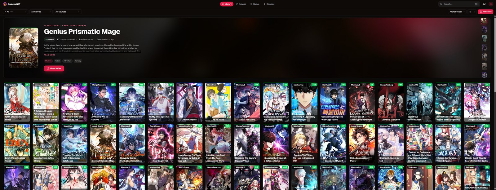
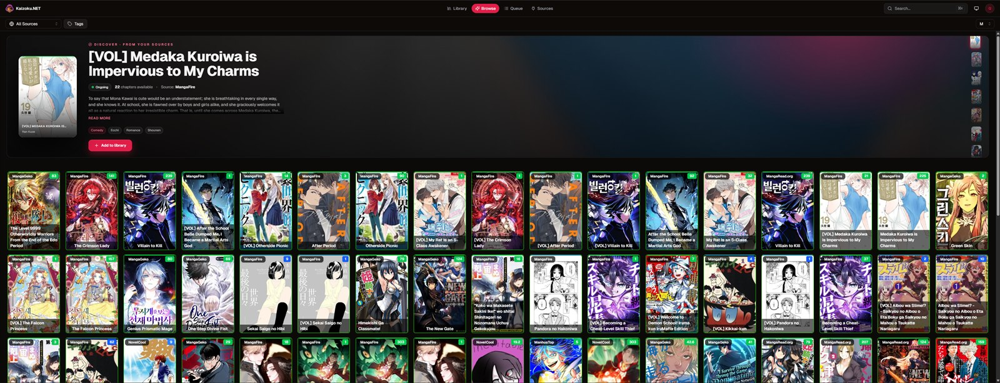
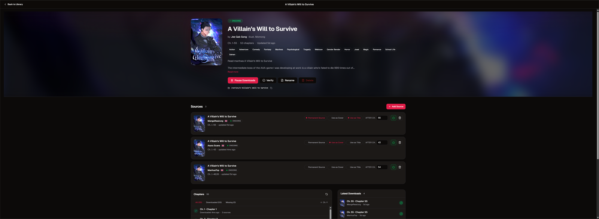
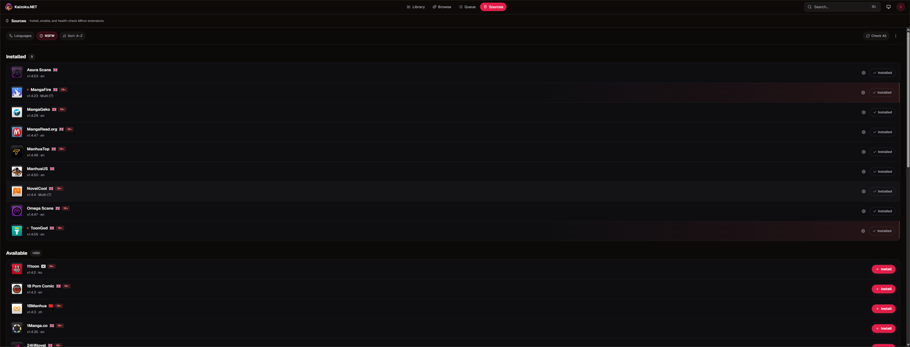
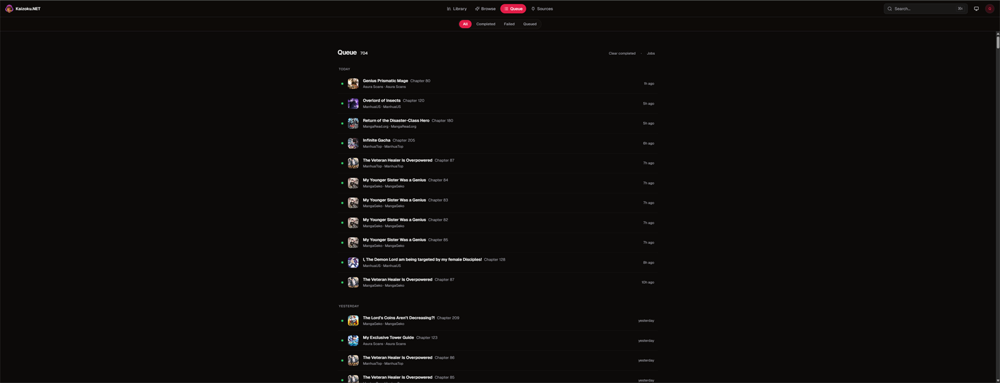
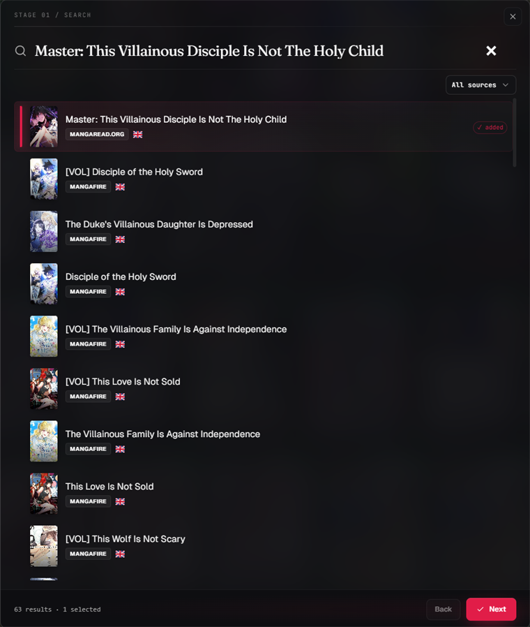
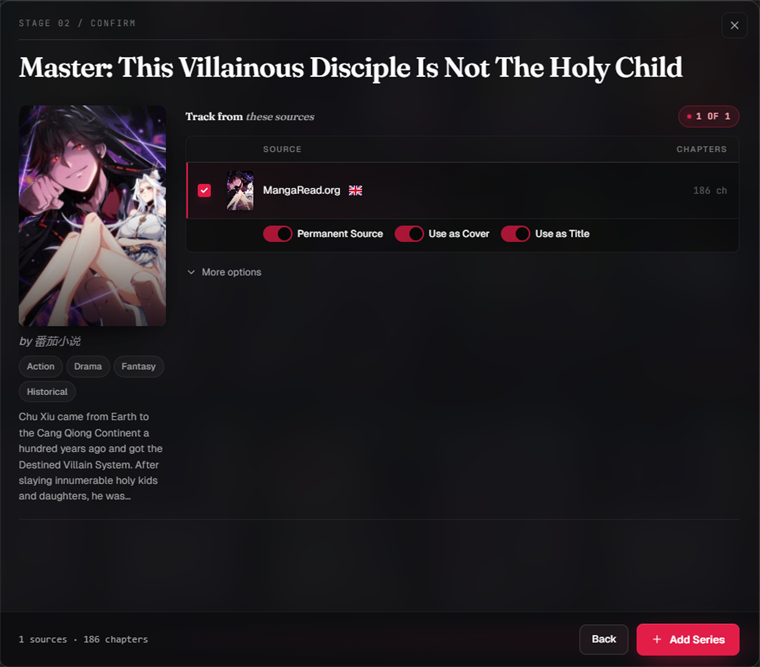

<table>
  <tr>
    <td width="150" border="0">
      </img>
    </td>
    <td>
      <strong>Kaizoku.NET</strong> &mdash; a community-maintained build of <a href="https://github.com/maxpiva/Kaizoku.NET">maxpiva/Kaizoku.NET</a>. Tracks upstream and lands fixes and features ahead of upstream cadence.<br/><br/>
      <strong>What does it do?</strong><br/>
      Subscribe to a series and Kaizoku.NET automatically downloads it. When the series is updated on any of your configured providers, new chapters are downloaded automatically &mdash; drop and forget.
    </td>
  </tr>
</table>

> **Lineage:** [OAE](https://github.com/oae/kaizoku) (original frontend) &rarr; [maxpiva](https://github.com/maxpiva/Kaizoku.NET) (.NET port + Mihon bridge) &rarr; this community-maintained build.

---

## 🎯 What It Does

Kaizoku.NET is a **series manager** focused on simplicity, speed, and reliability. It uses [Mihon extensions](https://github.com/mihonapp/mihon) to connect with multiple sources.

---

## ✨ Key Features

- 🧙‍♂️ **Startup Wizard** &mdash; Automatically imports your existing library.
- 🔁 **Temporary vs Permanent Sources**
  - Chapters download from **temporary** sources only when no permanent source provides them.
  - Auto-deleted if a **permanent** source later provides them.
- 🔎 **Multi-Search & Multi-Linking** &mdash; Link a single series to multiple sources.
- 📥 **Automatic Downloads, Retries, and Rescheduling**
- 🔄 **Auto-Updates** &mdash; Extensions stay current.
- 🧹 **Filename Normalization** &mdash; Consistent naming for easy reimport.
- 🧾 **ComicInfo.xml Injection** &mdash; Chapters include rich metadata from the original source.
- 🖼️ **Extras**
  - `cover.jpg` per series
  - `kaizoku.json` for full metadata mapping
  - And more.

---

## 📸 Screenshots

<table>
  <tr>
    <td align="center">
      </img>
      <br/><sub><b>Library</b> &mdash; a spotlight banner over your full cover grid</sub>
    </td>
  </tr>
  <tr>
    <td align="center">
      </img>
      <br/><sub>New chapters are flagged the moment a source updates</sub>
    </td>
  </tr>
  <tr>
    <td align="center">
      </img>
      <br/><sub><b>Series detail</b> &mdash; link multiple sources and mark them permanent or temporary</sub>
    </td>
  </tr>
  <tr>
    <td align="center">
      </img>
      <br/><sub><b>Sources</b> &mdash; install, enable, and health-check Mihon extensions</sub>
    </td>
  </tr>
  <tr>
    <td align="center">
      </img>
      <br/><sub><b>Queue</b> &mdash; live downloads with retries and rescheduling</sub>
    </td>
  </tr>
</table>

<table>
  <tr>
    <td width="50%" align="center" valign="top">
      </img>
      <br/><sub><b>Search</b> &mdash; find a series across every source at once</sub>
    </td>
    <td width="50%" align="center" valign="top">
      </img>
      <br/><sub><b>Add series</b> &mdash; confirm sources, covers, and titles before tracking</sub>
    </td>
  </tr>
</table>

---

## 🛠️ Under the Hood

- **Frontend**: Next.js UI originally derived from [Kaizoku Next by OAE](https://github.com/oae/kaizoku/tree/next), with significant redesign in this build.
- **Backend**: .NET engine that manages schedules, downloads, and metadata, with a Mihon Bridge for running Mihon Android extensions on .NET.

---

## 🤔 Running Android libraries on .NET &mdash; how?

Mihon extensions are distributed as Android APKs and require an Android runtime. To bridge that gap:

1. The Java/Android compatibility layer originally created by the [Suwayomi](https://github.com/Suwayomi/Suwayomi-Server) team is adapted (KCEF replaced with JCEF Maven) into a Java 8 Android compat layer with required dependencies included.
2. [IKVM](https://github.com/ikvmnet/ikvm) runs that compatibility layer on .NET.

---

## 🐳 Docker

Images are published to GitHub Container Registry for both `amd64` and `arm64`:

```
ghcr.io/quickkill0/kaizoku.net:main
```

### 📁 Volumes

| Container Path | Description                |
|----------------|----------------------------|
| `/config`      | Application configuration  |
| `/series`      | Downloaded series          |

### 🌐 Ports

| Port  | Service        | Required | Notes         |
|-------|----------------|----------|---------------|
| 9833  | Kaizoku.NET UI | ✅       | Web interface |

### 👤 Permissions

| Variable | Default | Description           |
|----------|---------|-----------------------|
| `UID`    | 99      | Host user ID          |
| `PGID`   | 100     | Host group ID         |
| `UMASK`  | 022     | File permission mask  |

Ensure the specified UID and PGID have write access to your mounted `/config` and `/series` directories.

### 🌐 Network Mode

Host networking is recommended for optimal performance under heavy parallel downloading and provider querying.

### 🚀 Run

```bash
docker run -d \
  --name kaizoku-net \
  --network host \
  -p 9833:9833 \
  -e UID=99 \
  -e PGID=100 \
  -e UMASK=022 \
  -v /path/to/your/config:/config \
  -v /path/to/your/series:/series \
  ghcr.io/quickkill0/kaizoku.net:main
```

Replace `/path/to/your/config` and `/path/to/your/series` with real paths on your host.

---

## 📦 Docker Compose

```yaml
services:
  kaizoku-net:
    container_name: kaizoku-net
    image: 'ghcr.io/quickkill0/kaizoku.net:main'
    volumes:
      - '/path/to/your/series:/series'
      - '/path/to/your/config:/config'
    environment:
      - UMASK=022
      - PGID=100
      - UID=99
    ports:
      - '9833:9833'
```

---

## 🐳 Unraid Template

```xml
<Container>
  <Name>Kaizoku.NET</Name>
  <Repository>ghcr.io/quickkill0/kaizoku.net:main</Repository>
  <Registry>https://github.com/Quickkill0/Kaizoku.NET/pkgs/container/kaizoku.net</Registry>
  <Network>host</Network>
  <MyID>kaizoku-net</MyID>
  <Shell>sh</Shell>
  <Privileged>false</Privileged>
  <Support>https://github.com/Quickkill0/Kaizoku.NET/issues</Support>
  <Project>https://github.com/Quickkill0/Kaizoku.NET</Project>
  <Overview>Community-maintained build of Kaizoku.NET — a feature-complete series manager powered by Mihon extensions.</Overview>
  <Category>MediaManager:Comics</Category>

  <Config Name="Config Folder" Target="/config" Default="/mnt/user/appdata/kaizoku-net" Mode="rw" Description="Path to store configuration, database, and settings." Type="Path" />
  <Config Name="Series Folder" Target="/series" Default="/mnt/user/media/series" Mode="rw" Description="Path where series and chapters will be downloaded." Type="Path" />

  <Config Name="UID" Target="UID" Default="99" Mode="rw" Description="User ID to run the container as." Type="Variable" />
  <Config Name="PGID" Target="PGID" Default="100" Mode="rw" Description="Group ID to run the container as." Type="Variable" />
  <Config Name="UMASK" Target="UMASK" Default="022" Mode="rw" Description="UMASK for file permissions." Type="Variable" />

  <WebUI>http://[IP]:9833</WebUI>

  <TemplateURL>https://raw.githubusercontent.com/Quickkill0/Kaizoku.NET/main/unraid/kaizoku-net.xml</TemplateURL>
  <Icon>https://raw.githubusercontent.com/Quickkill0/Kaizoku.NET/main/KaizokuFrontend/public/kaizoku.net.png</Icon>
</Container>
```

---

## 🖥️ Desktop App

A tray application based on Avalonia is available in the [Releases](https://github.com/Quickkill0/Kaizoku.NET/releases). Currently tested on **Windows**. Linux and macOS testing is welcome.

---

## 🧱 Build From Source

Build instructions are in progress. Until they land, see the workflows in `.github/workflows/` for the canonical build steps used by CI.

---

## ⚠️ Resource Usage

Kaizoku.NET can be memory-intensive when managing large libraries or running many parallel searches and downloads. Plan resources accordingly.

---

## ⚙️ Issues

If you encounter problems, check the `logs` folder. Logs there can be reviewed or attached when reporting an issue.

---

## 🤝 Contributing

PRs are welcome. For larger changes, open an issue first to discuss scope.
