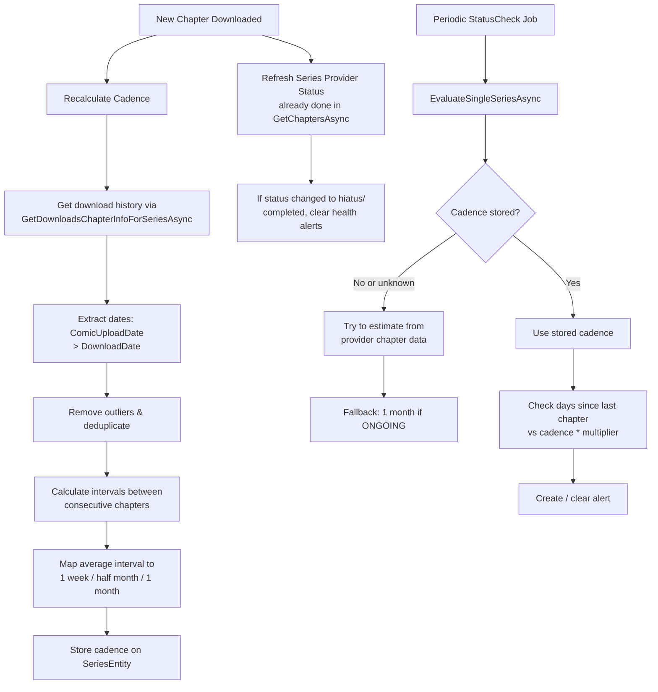

# Series Cadence Calculation Improvement Plan

## Problem Summary

The `EstimateReleaseCadence()` method in `StatusEvaluationService.cs:195` is currently a stub returning `-1`, always falling back to the default of 7 days. The cadence calculation needs to leverage actual download history to deduce a proper cadence (1 week, half month, or 1 month) for each series.

---

## Architecture Overview



## Phase 1: Add Cadence Field to SeriesEntity

**File: `KaizokuBackend/Models/Database/SeriesEntity.cs`**

Add a new nullable field to store the computed cadence in days:

```csharp
/// <summary>
/// Computed release cadence in days. Null = not yet determined.
/// Mapped to: 7 (1 week), 15 (half month), 30 (1 month).
/// </summary>
[JsonPropertyName("releaseCadenceDays")]
public int? ReleaseCadenceDays { get; set; }
```

Also add an EF Core migration to persist this new column.

**Files affected:**
- `KaizokuBackend/Models/Database/SeriesEntity.cs` — add field
- New EF Migration — add column to database
- `KaizokuBackend/Models/Dto/LatestSeriesDto.cs` — check if this DTO needs the field (optional)
- `KaizokuBackend/Extensions/SeriesModelExtensions.cs` — check mapping/extensions

## Phase 2: Create CadenceCalculationService

**New file: `KaizokuBackend/Services/Series/CadenceCalculationService.cs`**

This service encapsulates the cadence deduction algorithm. It depends on `DownloadQueryService` to get download history.

### Algorithm Details

**Input:** List of `DownloadChapterInfo` for a series, ordered by `ChapterNumber` descending.

**Step 1 — Extract effective dates:**
For each download entry:
- Use `Chapter.ComicUploadDateUTC` (ProviderUploadDate) if available
- Fall back to `DownloadDateUTC` if ComicUploadDate is null
- Discard entries with no usable date

**Step 2 — Filter & deduplicate (outlier removal):**
- Group entries by date (same day → single data point)
- **Detect bulk initial upload:** If the first N entries (e.g., first 3-5+ chapters) all fall within the same day or 2-3 day window, consider this a "bulk initial import" and exclude them from interval calculation.
- **Detect double releases:** If two consecutive chapters are dated 0-1 days apart but the running average is much larger, treat them as a single interval (the skipped release scenario). A simple heuristic: if an interval is < 20% of the median interval, merge it with the next interval.

**Step 3 — Calculate intervals:**
Sort entries chronologically (ascending by effective date). Calculate the gap in days between each consecutive pair.

**Step 4 — Map to standard cadence:**
Compute the median interval from the gaps (median is more robust than mean against outliers). Map to the closest standard cadence:

| Median Interval | Mapped Cadence |
|---|---|
| 1–10 days | 7 days (1 week) |
| 11–22 days | 15 days (half month) |
| 23+ days | 30 days (1 month) |

**Threshold: Minimum data points required:** At least 3 usable intervals (4+ distinct chapter dates) to compute a cadence. Otherwise, return null (undetermined).

**Step 5 — Store result:**
Update `SeriesEntity.ReleaseCadenceDays` with the mapped value.

**Fallback (null/undetermined):**
- If the series status is `ONGOING`, assume 30 days (1 month) as the maximum cadence
- If the series status is completed/hiatus/cancelled, leave null (no monitoring needed)

### Signature

```csharp
public class CadenceCalculationService
{
    public CadenceCalculationService(DownloadQueryService downloadQuery, AppDbContext db, ILogger<CadenceCalculationService> logger);
    
    /// <summary>
    /// Computes and stores the release cadence for a series.
    /// Returns the computed cadence in days, or null if undetermined.
    /// </summary>
    public async Task<int?> RecalculateCadenceAsync(Guid seriesId, CancellationToken token = default);
    
    /// <summary>
    /// Core cadence deduction logic (no DB writes, pure computation).
    /// </summary>
    public int? DeduceCadenceFromIntervals(List<double> dayIntervals);
    
    /// <summary>
    /// Deduplicates and filters outliers from raw dates.
    /// </summary>
    public List<DateTime> FilterAndDeduplicateDates(List<DateTime> rawDates);
}
```

## Phase 3: Wire Cadence Recalculation into Download Completion

**File: `KaizokuBackend/Services/Downloads/DownloadCommandService.cs`**

In the `DownloadChapterAsync()` method, after a successful download (near line 308, `return JobResult.Success`), hook the cadence recalculation:

1. After `await _db.SaveChangesAsync(token)` at line 271
2. Inject `CadenceCalculationService` into `DownloadCommandService`
3. Call `await _cadenceService.RecalculateCadenceAsync(ch.SeriesId, token).ConfigureAwait(false);`

Note: The recalculation should fire AFTER the provider chapter is saved (line 271), since the download date is persisted there.

## Phase 4: Wire Cadence Recalculation into GetChaptersAsync

**File: `KaizokuBackend/Services/Series/SeriesCommandService.cs`**

In the `GetChaptersAsync()` method, after new chapters are queued (around line 552), recalculate the cadence if new chapter data was found:

1. After line 549 (`await _db.SaveChangesAsync(token)`)
2. Call `await _cadenceService.RecalculateCadenceAsync(series.Id, token).ConfigureAwait(false);`

This ensures that cadence is recalculated both when:
- A chapter is actually downloaded (completes)
- New chapters are detected from the provider (but not yet downloaded)

## Phase 5: Update StatusEvaluationService to Use Stored Cadence

**File: `KaizokuBackend/Services/Status/StatusEvaluationService.cs`**

### 5a — Use stored cadence first

Modify `EvaluateSingleSeriesAsync()` to:
1. Check `series.ReleaseCadenceDays` first
2. If null, try to call `CadenceCalculationService.RecalculateCadenceAsync()` on-the-fly
3. If still null and series is ONGOING, use 30 days
4. If still null and series is not ONGOING, clear alerts and return

### 5b — Check provider status before creating alerts

Before creating a yellow/red alert (lines 107-112 and 97-101), add a check:

1. Get active providers for the series that are not disabled/uninstalled
2. For each active provider, check `LastSeriesInfoRefreshDate` — if it's stale (e.g., >7 days old), trigger a refresh of the series provider metadata
3. If ANY provider now reports `COMPLETED`, `CANCELLED`, or `ON_HIATUS`, clear any active alert and return early (the series is no longer actively releasing)

This prevents false warnings when a series has naturally ended or gone on hiatus.

**Important:** The `EvaluateSingleSeriesAsync` already skips non-ongoing series at lines 66-73. However, the check there uses the **cached** `series.Status`. If the provider's status changed, the series-level status might be stale. The new logic would:
1. Before skipping based on series.Status, try to detect if any provider has changed status
2. If status changed, update it and skip appropriately

## Phase 6: Update Settings (remove defaults or keep as absolute max)

**File: `KaizokuBackend/Models/Dto/EditableSettingsDto.cs`**

The existing `ReleaseCadenceDefaultDays` setting should remain as the **absolute maximum fallback** (if no cadence can be determined AND the series is not ONGOING). The new per-series cadence will take precedence.

Optionally rename `ReleaseCadenceDefaultDays` to `ReleaseCadenceMaxFallbackDays` for clarity.

## Phase 7: Frontend Display (Optional Enhancement)

**Files in `KaizokuFrontend/src/`**

Optionally display the computed cadence on the series detail page so users can see what cadence was deduced. This is a nice-to-have and can be deferred.

---

## Todo List

[ ] Add `ReleaseCadenceDays` field to `SeriesEntity` and create EF migration
[ ] Create `CadenceCalculationService` with the full algorithm (deduplication, outlier removal, interval calculation, cadence mapping)
[ ] Register `CadenceCalculationService` in DI (Program.cs)
[ ] Wire cadence recalculation into `DownloadCommandService.DownloadChapterAsync()` after successful download
[ ] Wire cadence recalculation into `SeriesCommandService.GetChaptersAsync()` after new chapters are detected
[ ] Update `StatusEvaluationService.EstimateReleaseCadence()` to use stored cadence with provider status re-check before alerting
[ ] Test edge cases: no downloads, bulk initial import, double releases, status changes