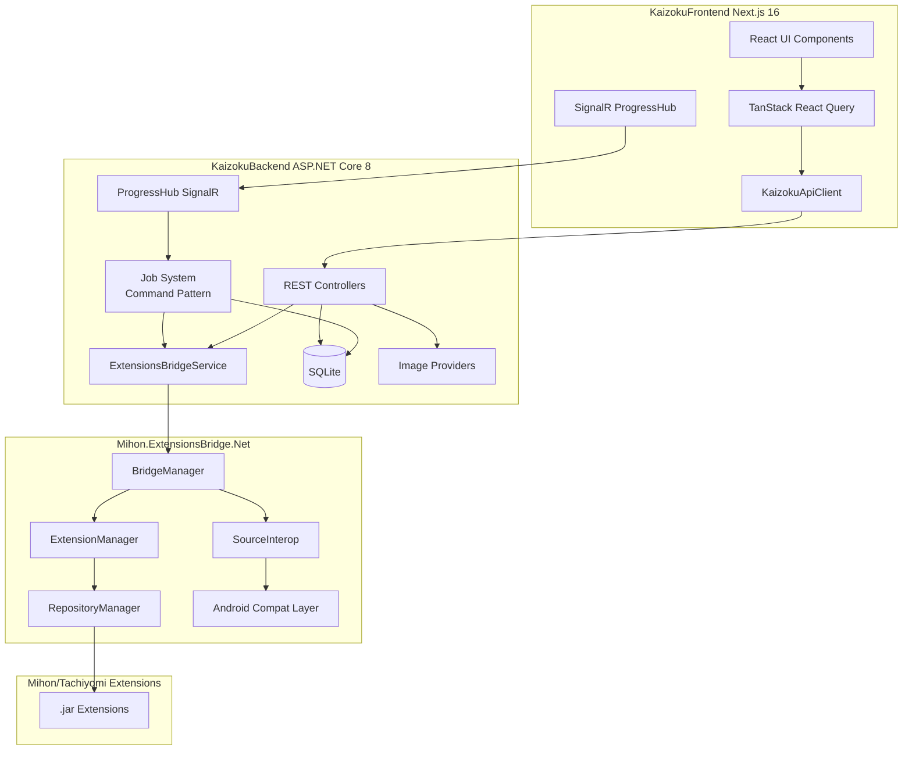
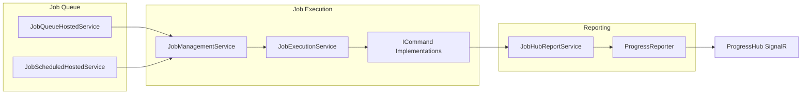

# Kaizoku.NET Codebase Map

## Overview

**Kaizoku.NET** is a self-hosted manga/comic series downloader that uses Mihon (formerly Tachiyomi) extensions to search, download, and manage manga series. It consists of four main projects:

| Project | Technology | Purpose |
|---------|-----------|---------|
| `KaizokuBackend` | .NET 8 ASP.NET Core (C#) | REST API + SignalR hub + background job processing |
| `KaizokuFrontend` | Next.js 16 + React 19 (TypeScript) | Web UI with Tailwind CSS + shadcn/ui |
| `KaizokuTray` | Avalonia UI (.NET) | System tray application for desktop management |
| `Mihon.ExtensionsBridge.Net` | .NET + IKVM + Android Compat Layer | Bridge to run Mihon/Tachiyomi Android extensions in .NET |

---

## 1. KaizokuBackend (`KaizokuBackend/`)

### 1.1 Entry Points

| File | Purpose |
|------|---------|
| [`Program.cs`](KaizokuBackend/Program.cs) | Application entry point. Initializes `EnvironmentSetup`, builds host, configures Kestrel on port 9833 |
| [`Startup.cs`](KaizokuBackend/Startup.cs) | Configures DI, middleware pipeline, CORS, SignalR, Swagger, static files, EF Core SQLite, and all service registrations |

### 1.2 Configuration

| File | Purpose |
|------|---------|
| [`appsettings.json`](KaizokuBackend/appsettings.json) | Main config: storage paths, bridge folder, thumb cache, Kestrel ports, Serilog logging, first-time defaults (languages, repos, download limits, FlareSolverr, SOCKS proxy) |
| [`launchSettings.json`](KaizokuBackend/Properties/launchSettings.json) | Debug/Release launch profiles |
| [`EnvironmentSetup.cs`](KaizokuBackend/Utils/EnvironmentSetup.cs) | Static utility that resolves data directory, extracts embedded wwwroot.zip, initializes Serilog, manages app settings path resolution |

### 1.3 Database (`Data/`)

| File | Purpose |
|------|---------|
| [`AppDbContext.cs`](KaizokuBackend/Data/AppDbContext.cs) | EF Core DbContext with 9 DbSets: `Series`, `Settings`, `SeriesProviders`, `Providers`, `Imports`, `ETagCache`, `Jobs`, `Queues`, `LatestSeries`. SQLite provider. Includes `GenericValueComparer` for list property tracking |

### 1.4 Database Entity Models (`Models/Database/`)

| Entity | Table | Purpose |
|--------|-------|---------|
| [`SeriesEntity`](KaizokuBackend/Models/Database/SeriesEntity.cs) | Series | Core series metadata (title, artist, author, genre, status, chapter count, thumbnail, storage path) |
| [`SeriesProviderEntity`](KaizokuBackend/Models/Database/SeriesProviderEntity.cs) | SeriesProviders | Links series to provider sources (provider ID, source ID, scanlator, URL) |
| [`ProviderStorageEntity`](KaizokuBackend/Models/Database/ProviderStorageEntity.cs) | Providers | Installed extension providers (package name, name, language, version) |
| [`SettingEntity`](KaizokuBackend/Models/Database/SettingEntity.cs) | Settings | Key-value application settings store |
| [`JobEntity`](KaizokuBackend/Models/Database/JobEntity.cs) | Jobs | Background job queue items |
| [`EnqueueEntity`](KaizokuBackend/Models/Database/EnqueueEntity.cs) | Queues | Download queue items (chapter downloads) |
| [`ImportEntity`](KaizokuBackend/Models/Database/ImportEntity.cs) | Imports | Import session tracking |
| [`EtagCacheEntity`](KaizokuBackend/Models/Database/EtagCacheEntity.cs) | ETagCache | HTTP ETag cache for thumbnails/images |
| [`LatestSerieEntity`](KaizokuBackend/Models/Database/LatestSerieEntity.cs) | LatestSeries | "Newly Minted" / cloud latest series tracking |

### 1.5 DTO Models (`Models/Dto/`)

Key DTOs organized by domain:

**Series:**
- [`SeriesExtendedDto`](KaizokuBackend/Models/Dto/SeriesExtendedDto.cs) - Full series detail response
- [`SeriesInfoDto`](KaizokuBackend/Models/Dto/SeriesInfoDto.cs) - Basic series info
- [`BaseSeriesDto`](KaizokuBackend/Models/Dto/BaseSeriesDto.cs) - Shared series base
- [`LinkedSeriesDto`](KaizokuBackend/Models/Dto/LinkedSeriesDto.cs) - Search result linking
- [`LatestSeriesDto`](KaizokuBackend/Models/Dto/LatestSeriesDto.cs) - Newly minted series
- [`SeriesIntegrityResultDto`](KaizokuBackend/Models/Dto/SeriesIntegrityResultDto.cs) - Archive integrity check result
- [`ArchiveIntegrityResultDto`](KaizokuBackend/Models/Dto/ArchiveIntegrityResultDto.cs) - Per-archive integrity

**Providers:**
- [`ExtensionDto`](KaizokuBackend/Models/Dto/ExtensionDto.cs) - Extension listing
- [`ExtensionEntryDto`](KaizokuBackend/Models/Dto/ExtensionEntryDto.cs) - Extension entry
- [`ExtensionRepositoryDto`](KaizokuBackend/Models/Dto/ExtensionRepositoryDto.cs) - Repository info
- [`ExtensionSourceDto`](KaizokuBackend/Models/Dto/ExtensionSourceDto.cs) - Source within extension
- [`ProviderExtendedDto`](KaizokuBackend/Models/Dto/ProviderExtendedDto.cs) - Extended provider info
- [`SmallProviderDto`](KaizokuBackend/Models/Dto/SmallProviderDto.cs) - Compact provider info
- [`ProviderPreferenceDto`](KaizokuBackend/Models/Dto/ProviderPreferenceDto.cs) - Single preference
- [`ProviderPreferencesDto`](KaizokuBackend/Models/Dto/ProviderPreferencesDto.cs) - All preferences for a provider
- [`ProviderMatchDto`](KaizokuBackend/Models/Dto/ProviderMatchDto.cs) - Provider match result
- [`ProviderMatchChapterDto`](KaizokuBackend/Models/Dto/ProviderMatchChapterDto.cs) - Chapter match within provider

**Downloads:**
- [`DownloadInfoDto`](KaizokuBackend/Models/Dto/DownloadInfoDto.cs) - Download item info
- [`DownloadInfoListDto`](KaizokuBackend/Models/Dto/DownloadInfoListDto.cs) - Paginated download list
- [`DownloadCardInfoDto`](KaizokuBackend/Models/Dto/DownloadCardInfoDto.cs) - Card view download info
- [`DownloadsMetricsDto`](KaizokuBackend/Models/Dto/DownloadsMetricsDto.cs) - Download statistics

**Search:**
- [`SearchSourceDto`](KaizokuBackend/Models/Dto/SearchSourceDto.cs) - Available search source
- [`AugmentedResponseDto`](KaizokuBackend/Models/Dto/AugmentedResponseDto.cs) - Augmented series response
- [`MatchInfoDto`](KaizokuBackend/Models/Dto/MatchInfoDto.cs) - Series match info

**Settings:**
- [`SettingsDto`](KaizokuBackend/Models/Dto/SettingsDto.cs) - Full settings
- [`EditableSettingsDto`](KaizokuBackend/Models/Dto/EditableSettingsDto.cs) - Editable subset

**Import:**
- [`ImportTotalsDto`](KaizokuBackend/Models/Dto/ImportTotalsDto.cs) - Import statistics

### 1.6 Domain Models (`Models/`)

| Model | Purpose |
|-------|---------|
| [`Chapter`](KaizokuBackend/Models/Chapter.cs) | Chapter metadata (number, index, page count, filename) |
| [`ChapterDownload`](KaizokuBackend/Models/ChapterDownload.cs) | Download queue item for a chapter |
| [`DownloadSummary`](KaizokuBackend/Models/DownloadSummary.cs) | Unified download summary |
| [`ProgressState`](KaizokuBackend/Models/ProgressState.cs) | SignalR progress update payload |
| [`ProviderSeriesDetails`](KaizokuBackend/Models/ProviderSeriesDetails.cs) | Provider-specific series details |
| [`ProviderSeriesOption`](KaizokuBackend/Models/ProviderSeriesOption.cs) | Provider series option |
| [`ImportSeriesResult`](KaizokuBackend/Models/ImportSeriesResult.cs) | Import operation result |
| [`ImportSeriesEntry`](KaizokuBackend/Models/ImportSeriesEntry.cs) | Import entry |
| [`ImportSeriesSnapshot`](KaizokuBackend/Models/ImportSeriesSnapshot.cs) | Import snapshot |
| [`ImportProviderSnapshot`](KaizokuBackend/Models/ImportProviderSnapshot.cs) | Provider snapshot during import |
| [`ProviderArchiveSnapshot`](KaizokuBackend/Models/ProviderArchiveSnapshot.cs) | Archive snapshot |
| [`CacheOptions`](KaizokuBackend/Models/CacheOptions.cs) | Thumbnail cache configuration |
| [`ImportChapterMetrics`](KaizokuBackend/Models/ImportChapterMetrics.cs) | Chapter import metrics |
| [`ImportSummaryBase`](KaizokuBackend/Models/ImportSummaryBase.cs) | Shared import base |
| [`DownloadSummaryBase`](KaizokuBackend/Models/DownloadSummaryBase.cs) | Shared download base |
| [`ChapterDescriptorBase`](KaizokuBackend/Models/ChapterDescriptorBase.cs) | Shared chapter descriptor |
| [`ProviderSummaryBase`](KaizokuBackend/Models/ProviderSummaryBase.cs) | Shared provider summary |
| [`SeriesProviderDetailsBase`](KaizokuBackend/Models/SeriesProviderDetailsBase.cs) | Shared series-provider details |
| [`SeriesSummaryBase`](KaizokuBackend/Models/SeriesSummaryBase.cs) | Shared series summary |

### 1.7 Enums (`Models/Enums/`)

| Enum | Values |
|------|--------|
| [`JobType`](KaizokuBackend/Models/Enums/JobType.cs) | `ScanLocalFiles`, `InstallAdditionalExtensions`, `SearchProviders`, `ImportSeries`, `GetChapters`, `GetLatest`, `Download`, `UpdateExtensions`, `UpdateAllSeries`, `DailyUpdate` |
| [`QueueStatus`](KaizokuBackend/Models/Enums/QueueStatus.cs) | Download queue states |
| [`ProgressStatus`](KaizokuBackend/Models/Enums/ProgressStatus.cs) | Progress states |
| [`SeriesStatus`](KaizokuBackend/Models/Enums/SeriesStatus.cs) | `UNKNOWN`, `ONGOING`, `COMPLETED`, `LICENSED`, `PUBLISHING_FINISHED`, `CANCELLED`, `HIATUS` |
| [`Priority`](KaizokuBackend/Models/Enums/Priority.cs) | Job priority levels |
| [`Action`](KaizokuBackend/Models/Enums/Action.cs) | Generic actions |
| [`ArchiveCompare`](KaizokuBackend/Models/Enums/ArchiveCompare.cs) | Archive comparison results |
| [`ArchiveResult`](KaizokuBackend/Models/Enums/ArchiveResult.cs) | Archive integrity results |
| [`EntryType`](KaizokuBackend/Models/Enums/EntryType.cs) | Entry type classification |
| [`ErrorDownloadAction`](KaizokuBackend/Models/Enums/ErrorDownloadAction.cs) | Error download management actions |
| [`ImportStatus`](KaizokuBackend/Models/Enums/ImportStatus.cs) | Import status states |
| [`InLibraryStatus`](KaizokuBackend/Models/Enums/InLibraryStatus.cs) | Library presence status |
| [`StartStop`](KaizokuBackend/Models/Enums/StartStop.cs) | Start/stop toggle |
| [`ValueType`](KaizokuBackend/Models/Enums/ValueType.cs) | Value type classification |

### 1.8 API Controllers (`Controllers/`)

| Controller | Route | Endpoints | Purpose |
|-----------|-------|-----------|---------|
| [`SeriesController`](KaizokuBackend/Controllers/SeriesController.cs) | `api/serie` | `GET /`, `GET /verify`, `GET /cleanup`, `POST /update-all`, `POST /`, `DELETE /`, `PATCH /pause`, `PATCH /reorder` | CRUD for series, integrity verification, cleanup, update-all |
| [`SearchController`](KaizokuBackend/Controllers/SearchController.cs) | `api/search` | `POST /augment`, `GET /sources`, `GET /` | Search series across providers, augment with metadata |
| [`DownloadsController`](KaizokuBackend/Controllers/DownloadsController.cs) | `api/downloads` | `GET /series`, `GET /`, `GET /metrics`, `PATCH /` | Download queue management, metrics |
| [`ProviderController`](KaizokuBackend/Controllers/ProviderController.cs) | `api/provider` | `GET /list`, `POST /install/{pkgName}`, `GET /preferences/{pkgName}`, `PUT /preferences/{pkgName}`, `DELETE /uninstall/{pkgName}`, `POST /repositories`, `DELETE /repositories` | Extension management, preferences |
| [`ImagesController`](KaizokuBackend/Controllers/ImagesController.cs) | `api/image` | `GET /{key}` | Thumbnail/image serving with ETag caching |
| [`SettingsController`](KaizokuBackend/Controllers/SettingsController.cs) | `api/settings` | `GET /`, `GET /languages`, `PUT /` | Application settings CRUD |
| [`SetupWizardController`](KaizokuBackend/Controllers/SetupWizardController.cs) | `api/setup` | `POST /scan`, `POST /install-extensions`, `POST /augment`, `POST /import`, `GET /import`, `GET /status`, `POST /finish` | First-time setup wizard flow |

### 1.9 SignalR Hub

| Hub | Route | Purpose |
|-----|-------|---------|
| [`ProgressHub`](KaizokuBackend/Hubs/ProgressHub.cs) | `/progress` | Real-time progress updates for jobs/downloads. Clients receive `Progress` events with typed `ProgressState` payloads |

### 1.10 Service Layer (`Services/`)

#### 1.10.1 Background Services (`Services/Background/`)

| Service | Purpose |
|---------|---------|
| [`JobQueueHostedService`](KaizokuBackend/Services/Background/JobQueueHostedService.cs) | Core background worker that polls job queues, manages concurrency slots, processes jobs via `JobExecutionService`. Uses `ConcurrentDictionary` for running job tracking |
| [`JobScheduledHostedService`](KaizokuBackend/Services/Background/JobScheduledHostedService.cs) | Scheduled job runner (daily updates, extension updates) |
| [`StartupHostedService`](KaizokuBackend/Services/Background/StartupHostedService.cs) | Runs on app startup - handles DB migrations, data migration from legacy Suwayomi |

#### 1.10.2 Job System (`Services/Jobs/`)

**Architecture:** Command pattern with auto-discovery via reflection.

| Component | Purpose |
|-----------|---------|
| [`ICommand`](KaizokuBackend/Services/Jobs/Models/ICommand.cs) | Interface: `JobType`, `ParameterType`, `ExecuteAsync()` |
| [`JobInfo`](KaizokuBackend/Services/Jobs/Models/JobInfo.cs) | Job context (ID, type, key, parameters, group key) |
| [`JobResult`](KaizokuBackend/Services/Jobs/Models/JobResult.cs) | Job execution result |
| [`JobQueues`](KaizokuBackend/Services/Jobs/Models/JobQueues.cs) | Queue definitions |
| [`JobManagementService`](KaizokuBackend/Services/Jobs/JobManagementService.cs) | Enqueue/dequeue/status management |
| [`JobExecutionService`](KaizokuBackend/Services/Jobs/JobExecutionService.cs) | Resolves `ICommand` by `JobType` name via reflection, creates instance via DI, executes |
| [`JobBusinessService`](KaizokuBackend/Services/Jobs/JobBusinessService.cs) | Business logic coordination for jobs |
| [`JobHubReportService`](KaizokuBackend/Services/Jobs/JobHubReportService.cs) | Reports job progress via SignalR |
| [`ProgressReporter`](KaizokuBackend/Services/Jobs/Report/ProgressReporter.cs) | Progress reporting utility |

**Command Implementations (`Services/Jobs/Commands/`):**

| Command | JobType | Purpose |
|---------|---------|---------|
| [`DailyUpdate`](KaizokuBackend/Services/Jobs/Commands/DailyUpdate.cs) | `DailyUpdate` | Daily scheduled update |
| [`Download`](KaizokuBackend/Services/Jobs/Commands/Download.cs) | `Download` | Download a single chapter |
| [`GetChapters`](KaizokuBackend/Services/Jobs/Commands/GetChapters.cs) | `GetChapters` | Fetch chapter list from provider |
| [`GetLatest`](KaizokuBackend/Services/Jobs/Commands/GetLatest.cs) | `GetLatest` | Get latest series from providers |
| [`ImportSeries`](KaizokuBackend/Services/Jobs/Commands/ImportSeries.cs) | `ImportSeries` | Import series from local files |
| [`InstallAdditionalExtensions`](KaizokuBackend/Services/Jobs/Commands/InstallAdditionalExtensions.cs) | `InstallAdditionalExtensions` | Install missing extensions |
| [`ScanLocalFiles`](KaizokuBackend/Services/Jobs/Commands/ScanLocalFiles.cs) | `ScanLocalFiles` | Scan local storage for series |
| [`SearchProviders`](KaizokuBackend/Services/Jobs/Commands/SearchProviders.cs) | `SearchProviders` | Search providers for series |
| [`UpdateAllSeries`](KaizokuBackend/Services/Jobs/Commands/UpdateAllSeries.cs) | `UpdateAllSeries` | Update all tracked series |
| [`UpdateExtensions`](KaizokuBackend/Services/Jobs/Commands/UpdateExtensions.cs) | `UpdateExtensions` | Update installed extensions |

**Settings:**
- [`JobsSettings`](KaizokuBackend/Services/Jobs/Settings/JobsSettings.cs) - Queue configuration (concurrency slots, polling interval)
- [`QueueSettings`](KaizokuBackend/Services/Jobs/Settings/QueueSettings.cs) - Per-queue settings

#### 1.10.3 Bridge Services (`Services/Bridge/`)

| Service | Purpose |
|---------|---------|
| [`ExtensionsBridgeService`](KaizokuBackend/Services/Bridge/ExtensionsBridgeService.cs) | High-level facade for Mihon.ExtensionsBridge. Manages extension descriptors, source interop, search, chapter fetching, manga details |
| [`MihonBridgeService`](KaizokuBackend/Services/Bridge/MihonBridgeService.cs) | Mihon-specific bridge operations |
| [`BridgeExtensionDescriptor`](KaizokuBackend/Services/Bridge/BridgeExtensionDescriptor.cs) | Descriptor model for installed extensions |
| [`BridgeKeyUtility`](KaizokuBackend/Services/Bridge/BridgeKeyUtility.cs) | Key generation utilities |
| [`BridgeMetadataBackfillService`](KaizokuBackend/Services/Bridge/BridgeMetadataBackfillService.cs) | Backfills metadata from bridge |
| [`BridgeSourceContext`](KaizokuBackend/Services/Bridge/BridgeSourceContext.cs) | Source context management |

#### 1.10.4 Series Services (`Services/Series/`)

| Service | Purpose |
|---------|---------|
| [`SeriesQueryService`](KaizokuBackend/Services/Series/SeriesQueryService.cs) | Query series (get by ID, list all, search) |
| [`SeriesCommandService`](KaizokuBackend/Services/Series/SeriesCommandService.cs) | Create, update, delete series |
| [`SeriesProviderService`](KaizokuBackend/Services/Series/SeriesProviderService.cs) | Manage series-provider relationships |
| [`SeriesArchiveService`](KaizokuBackend/Services/Series/SeriesArchiveService.cs) | Archive integrity verification, cleanup |
| [`SeriesExtensions`](KaizokuBackend/Services/Series/SeriesExtensions.cs) | Extension methods for series operations |

#### 1.10.5 Download Services (`Services/Downloads/`)

| Service | Purpose |
|---------|---------|
| [`DownloadQueryService`](KaizokuBackend/Services/Downloads/DownloadQueryService.cs) | Query download queue, metrics |
| [`DownloadCommandService`](KaizokuBackend/Services/Downloads/DownloadCommandService.cs) | Manage downloads (enqueue, retry, clear errors) |
| [`DownloadsExtensions`](KaizokuBackend/Services/Downloads/DownloadsExtensions.cs) | Extension methods |

#### 1.10.6 Search Services (`Services/Search/`)

| Service | Purpose |
|---------|---------|
| [`SearchQueryService`](KaizokuBackend/Services/Search/SearchQueryService.cs) | Query available search sources |
| [`SearchCommandService`](KaizokuBackend/Services/Search/SearchCommandService.cs) | Execute searches, augment series data |

#### 1.10.7 Provider Services (`Services/Providers/`)

| Service | Purpose |
|---------|---------|
| [`ProviderManagerService`](KaizokuBackend/Services/Providers/ProviderManagerService.cs) | Install/uninstall/list extensions |
| [`ProviderPreferencesService`](KaizokuBackend/Services/Providers/ProviderPreferencesService.cs) | Get/set provider preferences |
| [`ProviderCacheService`](KaizokuBackend/Services/Providers/ProviderCacheService.cs) | Cache provider metadata |

#### 1.10.8 Image Services (`Services/Images/`)

| Component | Purpose |
|-----------|---------|
| [`IImageProvider`](KaizokuBackend/Services/Images/IImageProvider.cs) | Interface: `CanProcess(url)`, `ObtainStreamAsync()` |
| [`UrlImageProvider`](KaizokuBackend/Services/Images/Providers/UrlImageProvider.cs) | Fetches images from URLs |
| [`ExtensionsImageProvider`](KaizokuBackend/Services/Images/Providers/ExtensionsImageProvider.cs) | Fetches images via extension bridge |
| [`StorageImageProvider`](KaizokuBackend/Services/Images/Providers/StorageImageProvider.cs) | Serves images from local storage |
| [`ThumbCacheService`](KaizokuBackend/Services/Images/ThumbCacheService.cs) | Thumbnail caching, ETag management, populates thumb URLs |

#### 1.10.9 Import Services (`Services/Import/`)

| Service | Purpose |
|---------|---------|
| [`ImportQueryService`](KaizokuBackend/Services/Import/ImportQueryService.cs) | Query import status/results |
| [`ImportCommandService`](KaizokuBackend/Services/Import/ImportCommandService.cs) | Execute imports |
| [`SeriesScanner`](KaizokuBackend/Services/Import/SeriesScanner.cs) | Scans local filesystem for series |
| [`SeriesComparer`](KaizokuBackend/Services/Import/SeriesComparer.cs) | Compares series for deduplication |
| [`ImportExtensions`](KaizokuBackend/Services/Import/ImportExtensions.cs) | Extension methods |
| **KavitaParser** (`Services/Import/KavitaParser/`) | Comic metadata parser (ComicInfo.xml, folder/file parsing) |

#### 1.10.10 Helper Services (`Services/Helpers/`)

| Service | Purpose |
|---------|---------|
| [`SettingsService`](KaizokuBackend/Services/Settings/SettingsService.cs) | Application settings CRUD |
| [`ArchiveHelperService`](KaizokuBackend/Services/Helpers/ArchiveHelperService.cs) | Archive file operations |
| [`DailyService`](KaizokuBackend/Services/Daily/DailyService.cs) | Daily update orchestration |
| [`EtagCacheService`](KaizokuBackend/Services/Helpers/EtagCacheService.cs) | ETag cache management |
| [`ContextProvider`](KaizokuBackend/Services/Helpers/ContextProvider.cs) | HTTP context accessor |
| [`NouisanceFixer20ExtraLarge`](KaizokuBackend/Services/Helpers/NouisanceFixer20ExtraLarge.cs) | Utility fixer service |

### 1.11 Extensions (`Extensions/`)

| Extension | Purpose |
|-----------|---------|
| [`ModelExtensions`](KaizokuBackend/Extensions/ModelExtensions.cs) | Entity-to-DTO mapping extensions |
| [`SeriesModelExtensions`](KaizokuBackend/Extensions/SeriesModelExtensions.cs) | Series-specific model extensions |
| [`DatabaseExtensions`](KaizokuBackend/Extensions/DatabaseExtensions.cs) | DB query helpers |
| [`FileSystemExtensions`](KaizokuBackend/Extensions/FileSystemExtensions.cs) | File I/O utilities |
| [`ImageExtensions`](KaizokuBackend/Extensions/ImageExtensions.cs) | Image processing |
| [`HttpExtensions`](KaizokuBackend/Extensions/HttpExtensions.cs) | HTTP request/response helpers |
| [`StringExtensions`](KaizokuBackend/Extensions/StringExtensions.cs) | String manipulation |
| [`CollectionsExtensions`](KaizokuBackend/Extensions/CollectionsExtensions.cs) | Collection utilities |
| [`NumericExtensions`](KaizokuBackend/Extensions/NumericExtensions.cs) | Numeric helpers |
| [`XmlExtensions`](KaizokuBackend/Extensions/XmlExtensions.cs) | XML parsing |
| [`OpenApiExtensions`](KaizokuBackend/Extensions/OpenApiExtensions.cs) | OpenAPI/Swagger config |
| [`PackageExtensions`](KaizokuBackend/Extensions/PackageExtensions.cs) | Package management |
| [`DownloadSummaryExtensions`](KaizokuBackend/Extensions/DownloadSummaryExtensions.cs) | Download summary projections |
| [`ImportMetricsExtensions`](KaizokuBackend/Extensions/ImportMetricsExtensions.cs) | Import metrics projections |
| [`ImportSeriesResultExtensions`](KaizokuBackend/Extensions/ImportSeriesResultExtensions.cs) | Import result projections |
| [`ProviderSummaryExtensions`](KaizokuBackend/Extensions/ProviderSummaryExtensions.cs) | Provider summary projections |

### 1.12 Migration (`Migration/`)

| Component | Purpose |
|-----------|---------|
| [`MigrationService`](KaizokuBackend/Migration/MigrationService.cs) | Orchestrates data migration from legacy Suwayomi DB to new schema |
| [`OldDBContext`](KaizokuBackend/Migration/OldDBContext.cs) | EF Core context for legacy Suwayomi database |
| **Models** (`Migration/Models/`) | Legacy entity models: `Chapter`, `Enqueue`, `ETagCache`, `Import`, `Job`, `LatestSerie`, `Mappings`, `ProviderSeriesDetails`, `ProviderStorage`, `Series`, `SeriesProvider`, `Setting`, `SuwayomiChapter`, `SuwayomiPreference`, `SuwayomiProp`, `SuwayomiSource` |

### 1.13 Utilities (`Utils/`)

| Utility | Purpose |
|---------|---------|
| [`AsyncLock`](KaizokuBackend/Utils/AsyncLock.cs) | Async mutex |
| [`KeyedAsyncLock`](KaizokuBackend/Utils/KeyedAsyncLock.cs) | Key-based async locking |
| [`LoggerInfrastructure`](KaizokuBackend/Utils/LoggerInfrastructure.cs) | Serilog logger factory |

---

## 2. KaizokuFrontend (`KaizokuFrontend/`)

### 2.1 Tech Stack

- **Framework:** Next.js 16 (static export mode)
- **UI Library:** React 19
- **Language:** TypeScript
- **Styling:** Tailwind CSS 4 + shadcn/ui (Radix primitives)
- **State/Data:** TanStack React Query 5, Zustand 5
- **Real-time:** SignalR (`@microsoft/signalr`)
- **Forms/Validation:** Zod
- **Animations:** Framer Motion
- **Virtualization:** react-window, react-virtualized-auto-sizer
- **Package Manager:** pnpm

### 2.2 Application Pages (`src/app/`)

| Route | Page Component | Purpose |
|-------|---------------|---------|
| `/` | [`page.tsx`](KaizokuFrontend/src/app/page.tsx) | Root - redirects to `/library` |
| `/library` | [`page.tsx`](KaizokuFrontend/src/app/library/page.tsx) | Library grid view of all series |
| `/library/series` | [`page.tsx`](KaizokuFrontend/src/app/library/series/page.tsx) | Individual series detail page |
| `/cloud-latest` | [`page.tsx`](KaizokuFrontend/src/app/cloud-latest/page.tsx) | "Newly Minted" - latest series from providers |
| `/queue` | [`page.tsx`](KaizokuFrontend/src/app/queue/page.tsx) | Download queue management |
| `/providers` | [`page.tsx`](KaizokuFrontend/src/app/providers/page.tsx) | Extension/source management |
| `/settings` | [`page.tsx`](KaizokuFrontend/src/app/settings/page.tsx) | Application settings |

### 2.3 Layout (`src/app/layout.tsx`)

Root layout wraps all pages with:
- `ThemeProvider` (dark/light/system)
- `TooltipProvider`
- `QueryProvider` (TanStack React Query)
- `SetupWizardProvider` (first-time setup state)
- `ImportWizardProvider` (import wizard state)
- `SearchProvider` (search context)
- `ClientSideSetupWizard` (modal overlay)
- `ImportWizard` (modal overlay)
- `FontLoader`

### 2.4 UI Components (`src/components/`)

#### Layout (`components/kzk/layout/`)
| Component | Purpose |
|-----------|---------|
| [`sidebar.tsx`](KaizokuFrontend/src/components/kzk/layout/sidebar.tsx) | Fixed left sidebar with navigation (Library, Newly Minted, Queue, Sources, Settings) + download counters |
| [`header.tsx`](KaizokuFrontend/src/components/kzk/layout/header.tsx) | Top header bar |
| [`breadcrumb.tsx`](KaizokuFrontend/src/components/kzk/layout/breadcrumb.tsx) | Breadcrumb navigation |
| [`download-counters.tsx`](KaizokuFrontend/src/components/kzk/layout/download-counters.tsx) | Real-time download progress counters |

#### Series Components (`components/kzk/series/`)
| Component | Purpose |
|-----------|---------|
| [`list-series/index.tsx`](KaizokuFrontend/src/components/kzk/series/list-series/index.tsx) | Library series grid/list |
| [`cloud-latest-grid.tsx`](KaizokuFrontend/src/components/kzk/series/cloud-latest-grid.tsx) | Newly minted series grid |
| [`cloud-latest-details-modal.tsx`](KaizokuFrontend/src/components/kzk/series/cloud-latest-details-modal.tsx) | Details modal for cloud series |
| [`add-series/index.tsx`](KaizokuFrontend/src/components/kzk/series/add-series/index.tsx) | Add series wizard container |
| [`add-series/steps/search-series-step.tsx`](KaizokuFrontend/src/components/kzk/series/add-series/steps/search-series-step.tsx) | Step 1: Search for series |
| [`add-series/steps/confirm-series-step.tsx`](KaizokuFrontend/src/components/kzk/series/add-series/steps/confirm-series-step.tsx) | Step 2: Confirm series details |

#### Setup Wizard (`components/kzk/setup-wizard/`)
| Component | Purpose |
|-----------|---------|
| [`index.tsx`](KaizokuFrontend/src/components/kzk/setup-wizard/index.tsx) | Setup wizard container |
| [`client-wrapper.tsx`](KaizokuFrontend/src/components/kzk/setup-wizard/client-wrapper.tsx) | Client-side wrapper |
| [`search-series-requester.tsx`](KaizokuFrontend/src/components/kzk/setup-wizard/search-series-requester.tsx) | Series search during setup |
| [`steps/add-providers-step.tsx`](KaizokuFrontend/src/components/kzk/setup-wizard/steps/add-providers-step.tsx) | Step: Add providers |
| [`steps/confirm-imports-step.tsx`](KaizokuFrontend/src/components/kzk/setup-wizard/steps/confirm-imports-step.tsx) | Step: Confirm imports |
| [`steps/finish-step.tsx`](KaizokuFrontend/src/components/kzk/setup-wizard/steps/finish-step.tsx) | Step: Finish setup |
| [`steps/import-local-step.tsx`](KaizokuFrontend/src/components/kzk/setup-wizard/steps/import-local-step.tsx) | Step: Import local files |
| [`steps/preferences-step.tsx`](KaizokuFrontend/src/components/kzk/setup-wizard/steps/preferences-step.tsx) | Step: Set preferences |
| [`steps/schedule-updates-step.tsx`](KaizokuFrontend/src/components/kzk/setup-wizard/steps/schedule-updates-step.tsx) | Step: Schedule updates |

#### Other Components
| Component | Purpose |
|-----------|---------|
| [`provider-manager.tsx`](KaizokuFrontend/src/components/kzk/provider-manager.tsx) | Provider/extension management UI |
| [`provider-preferences-requester.tsx`](KaizokuFrontend/src/components/kzk/provider-preferences-requester.tsx) | Provider preferences dialog |
| [`provider-settings-button.tsx`](KaizokuFrontend/src/components/kzk/provider-settings-button.tsx) | Provider settings trigger |
| [`settings-manager.tsx`](KaizokuFrontend/src/components/kzk/settings-manager.tsx) | Settings management UI |
| [`import-wizard/index.tsx`](KaizokuFrontend/src/components/kzk/import-wizard/index.tsx) | Import wizard modal |
| [`jobs/jobs-panel.tsx`](KaizokuFrontend/src/components/kzk/jobs/jobs-panel.tsx) | Background jobs status panel |
| [`downloads/DownloadsOverview.tsx`](KaizokuFrontend/src/components/downloads/DownloadsOverview.tsx) | Download overview component |
| [`dialogs/provider-match-dialog.tsx`](KaizokuFrontend/src/components/dialogs/provider-match-dialog.tsx) | Provider matching dialog |

#### UI Primitives (`components/ui/`)
shadcn/ui components: `badge`, `breadcrumb`, `button`, `card`, `checkbox`, `collapsible`, `dialog`, `drawer`, `dropdown-menu`, `input`, `label`, `lazy-image`, `multi-select`, `progress`, `radio-group`, `select`, `separator`, `sheet`, `slider`, `stepper`, `switch`, `table`, `tabs`, `tooltip`, `font-loader`, `last-chapter-badge`, `react-select`

### 2.5 API Layer (`src/lib/api/`)

| File | Purpose |
|------|---------|
| [`client.ts`](KaizokuFrontend/src/lib/api/client.ts) | `KaizokuApiClient` - generic HTTP client with GET/POST/PUT/PATCH/DELETE, JSON handling, FormData support |
| [`config.ts`](KaizokuFrontend/src/lib/api/config.ts) | API URL resolution (dev: `localhost:9833`, prod: relative or env var) |
| [`types.ts`](KaizokuFrontend/src/lib/api/types.ts) | TypeScript interfaces for all API DTOs (Chapter, Settings, LinkedSeries, FullSeries, SeriesStatus, ProgressState, etc.) |

**Service Modules (`src/lib/api/services/`):**
| Service | Purpose |
|---------|---------|
| [`seriesService.ts`](KaizokuFrontend/src/lib/api/services/seriesService.ts) | Series CRUD operations |
| [`searchService.ts`](KaizokuFrontend/src/lib/api/services/searchService.ts) | Search and augment operations |
| [`downloadsService.ts`](KaizokuFrontend/src/lib/api/services/downloadsService.ts) | Download queue operations |
| [`providerService.ts`](KaizokuFrontend/src/lib/api/services/providerService.ts) | Extension management |
| [`settingsService.ts`](KaizokuFrontend/src/lib/api/services/settingsService.ts) | Settings operations |
| [`setupWizardService.ts`](KaizokuFrontend/src/lib/api/services/setupWizardService.ts) | Setup wizard operations |
| [`queueService.ts`](KaizokuFrontend/src/lib/api/services/queueService.ts) | Queue operations |

**React Query Hooks (`src/lib/api/hooks/`):**
| Hook | Purpose |
|------|---------|
| [`useSeries.ts`](KaizokuFrontend/src/lib/api/hooks/useSeries.ts) | Series data hooks |
| [`useSearch.ts`](KaizokuFrontend/src/lib/api/hooks/useSearch.ts) | Search hooks |
| [`useDownloads.ts`](KaizokuFrontend/src/lib/api/hooks/useDownloads.ts) | Download hooks |
| [`useProviders.ts`](KaizokuFrontend/src/lib/api/hooks/useProviders.ts) | Provider hooks |
| [`useSettings.ts`](KaizokuFrontend/src/lib/api/hooks/useSettings.ts) | Settings hooks |
| [`useSetupWizard.ts`](KaizokuFrontend/src/lib/api/hooks/useSetupWizard.ts) | Setup wizard hooks |
| [`useQueue.ts`](KaizokuFrontend/src/lib/api/hooks/useQueue.ts) | Queue hooks |

**SignalR:**
| File | Purpose |
|------|---------|
| [`progressHub.ts`](KaizokuFrontend/src/lib/api/signalr/progressHub.ts) | `ProgressHub` class - manages SignalR connection, auto-reconnect, visibility handling, progress event listeners |

### 2.6 Contexts (`src/contexts/`)

| Context | Purpose |
|---------|---------|
| [`search-context.tsx`](KaizokuFrontend/src/contexts/search-context.tsx) | Global search state |
| [`series-context.tsx`](KaizokuFrontend/src/contexts/series-context.tsx) | Series state management |

### 2.7 Providers (`src/components/providers/`)

| Provider | Purpose |
|----------|---------|
| [`query-provider.tsx`](KaizokuFrontend/src/components/providers/query-provider.tsx) | TanStack Query client provider |
| [`setup-wizard-provider.tsx`](KaizokuFrontend/src/components/providers/setup-wizard-provider.tsx) | Setup wizard state provider |
| [`import-wizard-provider.tsx`](KaizokuFrontend/src/components/providers/import-wizard-provider.tsx) | Import wizard state provider |

### 2.8 Utilities (`src/lib/`)

| File | Purpose |
|------|---------|
| [`constants.ts`](KaizokuFrontend/src/lib/constants.ts) | App constants |
| [`utils.ts`](KaizokuFrontend/src/lib/utils.ts) | General utilities (cn function) |
| [`hooks/useDebounce.ts`](KaizokuFrontend/src/lib/hooks/useDebounce.ts) | Debounce hook |
| [`utils/language-country-mapping.ts`](KaizokuFrontend/src/lib/utils/language-country-mapping.ts) | Language to country code mapping |
| [`utils/series-status.ts`](KaizokuFrontend/src/lib/utils/series-status.ts) | Series status display helpers |
| [`utils/thumbnail.ts`](KaizokuFrontend/src/lib/utils/thumbnail.ts) | Thumbnail URL utilities |

---

## 3. KaizokuTray (`KaizokuTray/`)

### 3.1 Tech Stack
- **Framework:** Avalonia UI (.NET)
- **Purpose:** System tray application for Windows that manages the Kaizoku backend process

### 3.2 Key Files

| File | Purpose |
|------|---------|
| [`Program.cs`](KaizokuTray/Program.cs) | Entry point. Checks for existing instance, allocates console, starts Avalonia app |
| [`MainWindow.axaml`](KaizokuTray/MainWindow.axaml) | Main window XAML |
| [`MainWindow.axaml.cs`](KaizokuTray/MainWindow.axaml.cs) | Main window code-behind |
| [`App.axaml`](KaizokuTray/App.axaml) | Application XAML |
| [`App.axaml.cs`](KaizokuTray/App.axaml.cs) | Application code-behind |
| [`Utils/ConsoleUtils.cs`](KaizokuTray/Utils/ConsoleUtils.cs) | Windows console management (AllocConsole, SetConsoleIcon, disable close button) |
| [`Utils/AnsiConsoleUtils.cs`](KaizokuTray/Utils/AnsiConsoleUtils.cs) | ANSI console utilities |
| [`ViewModels/StorageFolderDialogViewModel.cs`](KaizokuTray/ViewModels/StorageFolderDialogViewModel.cs) | Storage folder selection dialog VM |
| [`Views/StorageFolderDialog.axaml`](KaizokuTray/Views/StorageFolderDialog.axaml) | Storage folder dialog view |
| [`Views/StorageFolderDialog.axaml.cs`](KaizokuTray/Views/StorageFolderDialog.axaml.cs) | Storage folder dialog code-behind |

---

## 4. Mihon.ExtensionsBridge.Net (`Mihon.ExtensionsBridge.Net/`)

### 4.1 Purpose
A bridge library that enables running Mihon/Tachiyomi Android extensions (originally written in Kotlin/Java for Android) within a .NET environment using IKVM and an Android compatibility layer.

### 4.2 Sub-Projects

| Project | Purpose |
|---------|---------|
| [`Mihon.ExtensionsBridge.Core`](Mihon.ExtensionsBridge.Net/Mihon.ExtensionsBridge.Core/) | Core bridge runtime: extension management, repository management, source interop, Dex-to-Jar conversion, working folder structure |
| [`Mihon.ExtensionsBridge.Models`](Mihon.ExtensionsBridge.Net/Mihon.ExtensionsBridge.Models/) | Shared models: extensions, filters, preferences, repositories, abstractions |
| [`IKVM.Android.Compatibility.Layer.Builder`](Mihon.ExtensionsBridge.Net/IKVM.Android.Compatibility.Layer.Builder/) | Builds the Android compatibility layer for IKVM |
| [`IKVM.Android.Compatibility.Layer.CILPatcher`](Mihon.ExtensionsBridge.Net/IKVM.Android.Compatibility.Layer.CILPatcher/) | Patches CIL for JSoup and general constructor compatibility |
| [`Android.Compatibility.Layer`](Mihon.ExtensionsBridge.Net/Android.Compatibility.Layer/) | Android API stubs (Kotlin/Java): Uri, Preferences, WebView, PackageManager, ConnectivityManager, etc. |

### 4.3 Core Architecture (`Mihon.ExtensionsBridge.Core/`)

| Component | Purpose |
|-----------|---------|
| [`BridgeHost`](Mihon.ExtensionsBridge.Net/Mihon.ExtensionsBridge.Core/Runtime/BridgeHost.cs) | Main bridge host runtime |
| [`BridgeManager`](Mihon.ExtensionsBridge.Net/Mihon.ExtensionsBridge.Core/Runtime/BridgeManager.cs) | Manages bridge lifecycle |
| [`SourceInterop`](Mihon.ExtensionsBridge.Net/Mihon.ExtensionsBridge.Core/Runtime/SourceInterop.cs) | Source interop for searching/fetching manga |
| [`JarExtensionInterop`](Mihon.ExtensionsBridge.Net/Mihon.ExtensionsBridge.Core/Runtime/JarExtensionInterop.cs) | JAR extension interop |
| [`ExtensionManager`](Mihon.ExtensionsBridge.Net/Mihon.ExtensionsBridge.Core/Services/ExtensionManager.cs) | Extension installation/loading |
| [`RepositoryManager`](Mihon.ExtensionsBridge.Net/Mihon.ExtensionsBridge.Core/Services/RepositoryManager.cs) | Repository management |
| [`RepositoryDownloader`](Mihon.ExtensionsBridge.Net/Mihon.ExtensionsBridge.Core/Services/RepositoryDownloader.cs) | Downloads extension repos |
| [`Dex2JarConverter`](Mihon.ExtensionsBridge.Net/Mihon.ExtensionsBridge.Core/Services/Dex2JarConverter.cs) | Converts Android DEX to JAR |
| [`WorkingFolderStructure`](Mihon.ExtensionsBridge.Net/Mihon.ExtensionsBridge.Core/Services/WorkingFolderStructure.cs) | Manages bridge working directories |
| **Gatekeeper** (`Runtime/Gatekeeper/`) | `GatekeptExtensionInterop`, `GatekeptSourceInterop` - security/sandboxing layer |
| **Utilities** (`Utilities/`) | `AndroidCompatLogManager`, `ChapterUtils`, `ContentTypeStream`, `H2DatabaseUtils`, `KotlinSuspendBridge` |

### 4.4 Models (`Mihon.ExtensionsBridge.Models/`)

| Model | Purpose |
|-------|---------|
| [`TachiyomiExtension`](Mihon.ExtensionsBridge.Net/Mihon.ExtensionsBridge.Models/TachiyomiExtension.cs) | Extension metadata |
| [`TachiyomiSource`](Mihon.ExtensionsBridge.Net/Mihon.ExtensionsBridge.Models/TachiyomiSource.cs) | Source within an extension |
| [`TachiyomiRepository`](Mihon.ExtensionsBridge.Net/Mihon.ExtensionsBridge.Models/TachiyomiRepository.cs) | Extension repository |
| [`RepositoryEntry`](Mihon.ExtensionsBridge.Net/Mihon.ExtensionsBridge.Models/RepositoryEntry.cs) | Repository entry |
| [`ExtensionWorkUnit`](Mihon.ExtensionsBridge.Net/Mihon.ExtensionsBridge.Models/ExtensionWorkUnit.cs) | Extension work unit |
| [`Preferences`](Mihon.ExtensionsBridge.Net/Mihon.ExtensionsBridge.Models/Preferences.cs) | Extension preferences |
| [`Meta`](Mihon.ExtensionsBridge.Net/Mihon.ExtensionsBridge.Models/Meta.cs) | Metadata |
| [`FileHash`](Mihon.ExtensionsBridge.Net/Mihon.ExtensionsBridge.Models/FileHash.cs) | File hashing |
| **Extensions** (`Models/Extensions/`) | `Chapter`, `Manga`, `MangaList`, `Page`, `ImageResponse`, `Status`, `Preference`, `SourcePreference`, `UniquePreference`, `UpdateStrategy` |
| **Filters** (`Models/Extensions/Filters/`) | `Filter`, `FilterList`, `CheckBox`, `Group`, `Header`, `Select`, `Separator`, `Sort`, `Text`, `TriState` |
| **Abstractions** (`Models/Abstractions/`) | `IBridgeManager`, `IExtensionInterop`, `IExtensionManager`, `IFilter`, `IRepositoryManager`, `ISourceInterop`, `ITemporaryDirectory`, `IWorkingFolderStructure` |

---

## 5. Data Flow Architecture

## 6. Job Processing Flow

## 7. Key Design Patterns

1. **CQRS** - Separate Query/Command services for Series, Downloads, Search, and Import domains
2. **Command Pattern** - Job system uses `ICommand` interface with auto-discovery via reflection
3. **Strategy Pattern** - `IImageProvider` with multiple implementations (URL, Extension, Storage)
4. **Chain of Responsibility** - Image providers tried in sequence
5. **Provider Pattern** - React context providers for state management (SetupWizard, ImportWizard, Search, Theme, Query)
6. **Facade Pattern** - `ExtensionsBridgeService` wraps complex bridge interactions
7. **Singleton Background Services** - `JobQueueHostedService`, `JobScheduledHostedService` run as singletons

## 8. Build & Deployment

| Script | Purpose |
|--------|---------|
| [`build_apps.ps1`](build_apps.ps1) | Build all applications |
| [`build_docker.ps1`](build_docker.ps1) | Build Docker images |
| [`build_frontend.ps1`](build_frontend.ps1) | Build frontend only |
| [`Dockerfile`](KaizokuBackend/Dockerfile) | Backend Docker image |
| [`entrypoint.sh`](KaizokuBackend/scripts/entrypoint.sh) | Docker entrypoint |
| [`Kaizoku.sln`](Kaizoku.sln) | .NET solution file |

## 9. Configuration Reference

| Setting | Default | Description |
|---------|---------|-------------|
| `StorageFolder` | (empty) | Series storage directory |
| `BridgeFolder` | `mihon` | Extension bridge folder |
| `ThumbCacheFolder` | `thumbs` | Thumbnail cache folder |
| `CacheCheckInDays` | `7` | Cache cleanup interval |
| `PreferredLanguages` | `["en"]` | Default search languages |
| `MihonRepositories` | keiyoushi/extensions | Extension repositories |
| `NumberOfSimultaneousDownloads` | `10` | Max concurrent downloads |
| `NumberOfSimultaneousSearches` | `10` | Max concurrent searches |
| `CategorizedFolders` | `true` | Organize by category |
| `FlareSolverrEnabled` | `false` | Cloudflare bypass |
| `SocksProxyEnabled` | `false` | SOCKS proxy support |
| Kestrel Port | `9833` | HTTP server port |
