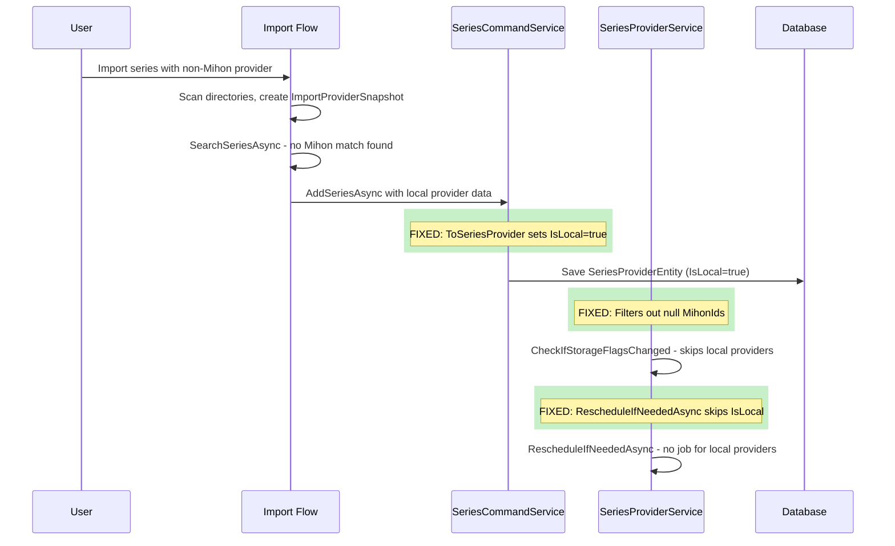

# Local Provider Support - Complete Enablement Plan

## Overview

A **local provider** is a `SeriesProviderEntity` where `MihonProviderId == null` and `MihonId == null`, representing a provider that was created locally (via import matching, user matching, or migration) rather than from a Mihon extension. `IsLocal = true` should always be set for these providers.

## Current State Summary

After analyzing the entire codebase, I found **3 critical bugs**, **1 startup fix needed**, **1 scheduling fix**, and **1 import flow gap**. Below is the detailed analysis.

---

## Issue 1: NRE in `CheckIfTheStorageFlagsChangedTheInLibraryStatusOfLastSeriesAsync`

**Location**: [`KaizokuBackend/Services/Series/SeriesProviderService.cs:268`](KaizokuBackend/Services/Series/SeriesProviderService.cs:268)

**Code**:
```csharp
List<string> ids = providers.Select(a => a.MihonId!)
    .Where(id => !string.IsNullOrWhiteSpace(id))
    .Union(deletedList)
    .ToList();
```

**Problem**: The null-forgiving operator `!` on `MihonId` will throw a `NullReferenceException` for any local provider where `MihonId` is `null`. This method is called from:
- `SeriesCommandService.AddSeriesAsync` (line 105-106)
- `SeriesCommandService.UpdateSeriesAsync` (line 176-177)
- `ImportCommandService.SearchSeriesAsync` (line 446-447)

**Fix**: Filter out `null` MihonIds before selecting:

```csharp
List<string> ids = providers
    .Where(a => !string.IsNullOrWhiteSpace(a.MihonId))
    .Select(a => a.MihonId!)
    .Union(deletedList.Where(id => !string.IsNullOrWhiteSpace(id)))
    .ToList();
```

---

## Issue 2: `ToSeriesProvider` Missing `IsLocal = true`

**Location**: [`KaizokuBackend/Services/Series/SeriesExtensions.cs:877`](KaizokuBackend/Services/Series/SeriesExtensions.cs:877)

**Code**:
```csharp
return new SeriesProviderEntity
{
    // ... other fields ...
    // IsLocal is NOT SET!
};
```

**Problem**: When an `ImportProviderSnapshot` has no Mihon association (no matching extension), the resulting `SeriesProviderEntity` will have `IsLocal = false` by default. This method is called from:
- `SeriesCommandService.ProcessSeriesProvidersAsync` line 628 (for remaining infos that didn't match any augmented series)

**Fix**: Set `IsLocal = true` when the provider name is not "Unknown":

```csharp
IsLocal = ImportProviderSnapshot.Provider != "Unknown",
```

---

## Issue 3: `GetChaptersAsync` Returns `JobResult.Failed` Instead of `JobResult.Delete`

**Location**: [`KaizokuBackend/Services/Series/SeriesCommandService.cs:411-416`](KaizokuBackend/Services/Series/SeriesCommandService.cs:411)

**Code**:
```csharp
if (string.IsNullOrEmpty(serie.MihonProviderId))
{
    _logger.LogWarning("Series Provider {SeriesProvider} has no longer valid Mihon Id", seriesProvider);
    return JobResult.Failed;
}
```

**Problem**: Returns `Failed` which keeps the job alive and retrying forever. The job infrastructure interprets `Delete` as a signal to clean up the recurring job.

**Fix**: Change to `return JobResult.Delete;` so the incorrect job gets cleaned up.

---

## Issue 4: Database Startup Fix - `IsLocal = false` When `MihonId = null`

**Location**: [`KaizokuBackend/Services/Background/StartupHostedService.cs`](KaizokuBackend/Services/Background/StartupHostedService.cs)

**Problem**: Users who migrated from v1.0 may have `SeriesProviderEntity` records where `IsLocal = false` but `MihonProviderId = null`. This is because the old [`ConvertSeriesProviderAsync`](KaizokuBackend/Migration/MigrationService.cs:705) first sets `IsLocal = false` and only later sets it to `true` if no extension was found (line 734).

**Fix**: Add a database fixup in `StartupHostedService.StartAsync` after the existing `_fixes.FixThumbnails...` call:

```csharp
// Fix: Ensure IsLocal = true for all providers without MihonProviderId
var localProviders = await db.SeriesProviders
    .Where(a => string.IsNullOrEmpty(a.MihonProviderId) && !a.IsUnknown && !a.IsLocal)
    .ToListAsync(cancellationToken);
if (localProviders.Count > 0)
{
    _logger.LogInformation("Fixing {Count} SeriesProviders with missing IsLocal flag", localProviders.Count);
    foreach (var p in localProviders)
        p.IsLocal = true;
    await db.SaveChangesAsync(cancellationToken);
}
```

---

## Issue 5: Import Flow Gap for New Series With Only Local Providers

**Location**: [`KaizokuBackend/Services/Import/ImportCommandService.cs:455-577`](KaizokuBackend/Services/Import/ImportCommandService.cs:455)

**Problem**: In `SearchSeriesAsync` for new series (non-existing), when a provider has no matching Mihon extension, it goes into the `left` list, gets searched by title across Mihon sources, and if no match found, the **entire import entry is marked as `Skip`**. This discards local provider data.

**Scope**:
- In the `else` branch (new series, line 451), when `!success` and `left.Count > 0`, instead of marking as `Skip`, preserve left-over providers as local import options
- The `AugmentSeriesAsync` in [`SearchCommandService.cs:70`](KaizokuBackend/Services/Search/SearchCommandService.cs:70) skips items with no `MihonId` — need to add a local provider augmentation path

**Status**: SEPARATE TASK - Not included in initial implementation.

---

## Issue 6: `RescheduleIfNeededAsync` Should Skip Local Providers

**Location**: [`KaizokuBackend/Services/Series/SeriesProviderService.cs:251`](KaizokuBackend/Services/Series/SeriesProviderService.cs:251)

**Code**:
```csharp
foreach (SeriesProviderEntity p in providers.Where(a => !a.IsUnknown))
```

**Problem**: Local providers pass the `!a.IsUnknown` filter and get scheduled for `GetChapters` jobs, even though they have no `MihonProviderId`. The `ManageSeriesProviderJobAsync` schedules recurring jobs that always fail.

**Fix**: Add `&& !a.IsLocal` to the filter:

```csharp
foreach (SeriesProviderEntity p in providers.Where(a => !a.IsUnknown && !a.IsLocal))
```

---

## Task List (Implementation Order)

| # | Priority | Issue | File | Change |
|---|----------|-------|------|--------|
| 1 | Critical | NRE on null MihonId | `SeriesProviderService.cs:268` | Filter nulls before selecting |
| 2 | Critical | Missing IsLocal flag | `SeriesExtensions.cs:877` | Add `IsLocal = true` |
| 3 | Critical | GetChapters keeps retrying | `SeriesCommandService.cs:411` | Return `Delete` instead of `Failed` |
| 4 | High | Reschedule shouldn't schedule locals | `SeriesProviderService.cs:251` | Add `&& !a.IsLocal` |
| 5 | High | Startup DB fix for migrated data | `StartupHostedService.cs` | Query + fix IsLocal flag |
| 6 | Medium | Import flow gap (separate task) | `ImportCommandService.cs` | Handle local-only new series |

---

## Sequence Diagram: Local Provider After Fixes



---

## Startup Fix Data Flow

```mermaid
flowchart TD
    A[Server Starts] --> B[StartupHostedService.StartAsync]
    B --> C[Run MigrationService]
    C --> D{DB Migrated?}
    D -->|Yes| E[Run Database MigrateAsync]
    E --> F[Run NouisanceFixer]
    F --> G[NEW: Fix IsLocal flag]
    G --> H[Query SeriesProviders WHERE<br/>MihonProviderId IS NULL AND<br/>NOT IsUnknown AND NOT IsLocal]
    H --> I{Found Any?}
    I -->|Yes| J[Set IsLocal = true for all]
    J --> K[SaveChangesAsync]
    I -->|No| L[Continue startup]
    K --> L