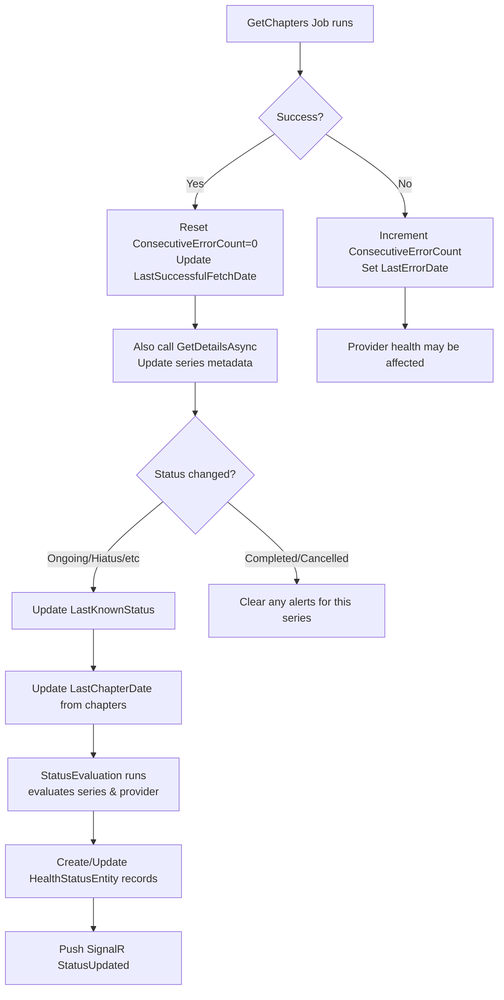
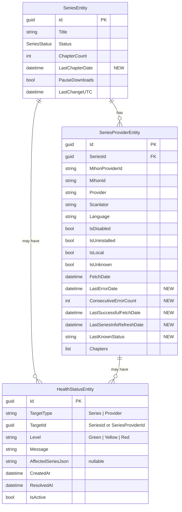

# Status Page & Health Monitoring Plan

> **Decisions from User:**
> - Add `DROPPED` to `SeriesStatus` enum ✓
> - Always refresh metadata (call `GetDetailsAsync`) every time `GetChaptersAsync` runs ✓
> - Status evaluation runs as a **new recurring job** hourly ✓
> - Provider tree shows only series that have yellow/red status ✓

## 1. Problem Statement

We need a Status page that shows real-time health signals for **Series** and **Sources (Providers)**. The system must:

- Detect when a series stops receiving new chapters beyond expected release cadence → Yellow/Red
- Detect when a source (Mihon extension) experiences errors → Yellow/Red
- Intelligently handle series status transitions (Ongoing→Hiatus→Completed→Dropped)
- Track errors per provider for health monitoring
- Provide a tree-expandable UI (Provider → Affected Series)
- Support converting uninstalled Mihon providers into user-based providers (and vice-versa)
- Auto-clear status when problems are resolved

---

## 2. Gaps Identified

### 2.1. Missing Database Entities & Fields

| Gap | Details |
|-----|---------|
| **No `DROPPED` in SeriesStatus enum** | User mentions "source changes status to Dropped" but enum only has: UNKNOWN, ONGOING, COMPLETED, LICENSED, PUBLISHING_FINISHED, CANCELLED, ON_HIATUS. Need to add DROPPED. |
| **No status/alert entity** | No table stores per-series or per-provider health status with timestamps, messages, severity. |
| **No error tracking on SeriesProviderEntity** | No field for `LastErrorDate`, `ConsecutiveErrorCount`, or error log. |
| **No last-chapter-date aggregate on SeriesEntity** | Need a `LastChapterDate` field or computed view to calculate release cadence without scanning all chapters. |
| **No `LastSeriesRefreshDate` on SeriesProviderEntity** | Needed to know when the series metadata (status, description) was last refreshed from the extension. |

### 2.2. Missing Configuration

| Gap | Details |
|-----|---------|
| **Release cadence thresholds** | 2.0x for yellow, 5.0x for red — need to be in `EditableSettingsDto` / settings UI |
| **Error threshold durations** | 48 hours for yellow, 168 hours (1 week) for red — configurable |
| **Default release cadence** | Heuristic: "most series are weekly or monthly" — needs a configurable default value |

### 2.3. Missing Business Logic

| Gap | Details |
|-----|---------|
| **No health evaluation job** | No recurring job that evaluates all series/providers and updates status. |
| **No series-info refresh in GetChaptersAsync** | Currently only fetches chapters, does NOT refresh series metadata (status, description, etc.) from the Mihon extension. GetDetailsAsync exists but is not called. |
| **No "Dropped" detection from sources** | System must detect when a source no longer returns a series (e.g., removed from latest list). |
| **No automatic status clearing** | No logic to auto-turn-green when a provider starts working again or a series gets new chapters. |
| **No provider-to-user-based conversion** | When uninstalling a Mihon extension, providers linked to it should become user-based (IsLocal=true, MihonProviderId=null). Inverse also unsupported. |

### 2.4. Missing Frontend

| Gap | Details |
|-----|---------|
| **No Status page** | New route `/status` with layout/page components. |
| **No status DTO/API** | No endpoint to query status data. |
| **No tree-expandable provider list** | Required for showing provider → affected series hierarchy. |
| **No sidebar entry** | Need to add "Status" to the sidebar. |
| **No settings UI for thresholds** | No UI to configure release cadence multipliers or error thresholds. |

### 2.5. Ambiguities to Resolve

| Ambiguity | Question |
|-----------|----------|
| "Source change the status of the Series to Dropped" | Does this mean the Mihon extension returns status=DROPPED (doesn't exist yet) or that the source simply stops appearing in the provider's latest-series list? |
| "Series Status didn't change (Ongoing, publishing)" | Should we trust the Mihon extension's reported status? If Mihon says ONGOING but no chapters → yellow. If Mihon changes to COMPLETED → no alert. |
| "Provider status should have a tree option" | Tree view on the status page: expand a provider → see all series using that provider → see their alert status. |
| "User should have the option to uninstall the provider from mihon" | This is a per-series operation? Or a global action? Per-series: sets `IsUninstalled=true`, `MihonProviderId=null`, `IsLocal=true` on the `SeriesProviderEntity`. |

---

## 3. Proposed Architecture

### 3.1. New Database Entities

#### `HealthStatusEntity` — General health status for both series and providers

```csharp
public enum HealthStatusLevel
{
    Green,    // No issues — may not need an entity record
    Yellow,   // Warning
    Red       // Critical
}

public enum HealthStatusTargetType
{
    Series,
    Provider
}

public class HealthStatusEntity
{
    public Guid Id { get; set; }
    public HealthStatusTargetType TargetType { get; set; }  // Series or Provider
    public Guid TargetId { get; set; }                       // SeriesId or SeriesProviderId
    public HealthStatusLevel Level { get; set; }
    public string Message { get; set; } = string.Empty;      // e.g., "No releases for 14 days"
    public string? AffectedSeriesJson { get; set; }          // For Provider-level: JSON list of affected series IDs/titles
    public DateTime CreatedAt { get; set; }
    public DateTime? ResolvedAt { get; set; }                // When the issue was cleared
    public bool IsActive { get; set; }                       // Quick filter for active alerts
}
```

#### Fields added to `SeriesProviderEntity`

```csharp
// Error tracking
public DateTime? LastErrorDate { get; set; }
public int ConsecutiveErrorCount { get; set; }              // Reset on successful fetch
public DateTime? LastSuccessfulFetchDate { get; set; }

// Series metadata refresh tracking
public DateTime? LastSeriesInfoRefreshDate { get; set; }     // When we last called GetDetailsAsync
public SeriesStatus? LastKnownStatus { get; set; }            // Cached for change detection
```

#### Fields added to `SeriesEntity`

```csharp
public DateTime? LastChapterDate { get; set; }                // Most recent chapter's ProviderUploadDate across all sources
```

### 3.2. Configuration (Settings)

Add to `EditableSettingsDto`:

```csharp
[JsonPropertyName("releaseCadenceMultiplierYellow")]
public double ReleaseCadenceMultiplierYellow { get; set; } = 2.0;

[JsonPropertyName("releaseCadenceMultiplierRed")]
public double ReleaseCadenceMultiplierRed { get; set; } = 5.0;

[JsonPropertyName("releaseCadenceDefaultDays")]
public int ReleaseCadenceDefaultDays { get; set; } = 7;       // Heuristic: assume weekly

[JsonPropertyName("providerErrorYellowHours")]
public int ProviderErrorYellowHours { get; set; } = 48;        // 2 days

[JsonPropertyName("providerErrorRedHours")]
public int ProviderErrorRedHours { get; set; } = 168;          // 1 week
```

### 3.3. New/Modified Services

#### New: `StatusEvaluationService`
- **Purpose**: Evaluate all series and providers for health status
- **Evaluation scope**: Runs as a new `StatusCheck` job type (or extend `DailyUpdate`)
- **Logic** (see Section 4 for detailed rules)

#### Modified: `SeriesCommandService.GetChaptersAsync`
- **After successful chapter fetch**: Reset `ConsecutiveErrorCount=0`, update `LastSuccessfulFetchDate`
- Also call `GetDetailsAsync` to refresh series metadata (status, description, etc.)
- Update `LastSeriesInfoRefreshDate` and `LastKnownStatus` on the provider

#### Modified: `SeriesCommandService`
- Add error tracking: On `GetChaptersAsync` failure, increment `ConsecutiveErrorCount` and set `LastErrorDate`

#### Modified: `DailyService`
- Add health status evaluation as part of daily maintenance (or create a new job type)

#### New: Status API Endpoints

| Endpoint | Method | Description |
|----------|--------|-------------|
| `/api/status/series` | GET | All series with active health alerts |
| `/api/status/providers` | GET | All providers with active health alerts + affected series |
| `/api/status/summary` | GET | Count of yellow/red for badges (sidebar) |
| `/api/status/clear` | POST | Manually clear a health status entry |

### 3.4. Database Migration

- Create `HealthStatusEntity` table
- Add columns to `SeriesProviderEntity` (LastErrorDate, ConsecutiveErrorCount, LastSuccessfulFetchDate, LastSeriesInfoRefreshDate, LastKnownStatus)
- Add `LastChapterDate` column to `SeriesEntity`

### 3.5. SignalR Updates

Extend `ProgressHub` with a status group:

```csharp
// Client-callable methods
// "StatusUpdated" — pushed when health status changes
```

---

## 4. Detailed Health Evaluation Logic

### 4.1. Series → Yellow (Warning)

**Entry Condition (ALL must be true):**
1. Series `Status` is `ONGOING` or `UNKNOWN` (not COMPLETED, CANCELLED, ON_HIATUS, PUBLISHING_FINISHED, DROPPED)
2. At least 1 active, non-disabled, non-uninstalled `SeriesProviderEntity` exists
3. `SeriesEntity.LastChapterDate` is NOT null
4. Days since `LastChapterDate` > (estimated cadence × `ReleaseCadenceMultiplierYellow`)

**Release Cadence Estimation Heuristic:**
- Look at the last 3-5 chapters from all providers, compute average interval
- If fewer than 2 chapters exist, use `ReleaseCadenceDefaultDays` from config
- Minimum cadence: 1 day (to avoid false positives)

**Status Message:** `"No new chapters for [XX] days (expected cadence: [YY] days)"`

**Exit Condition (auto-green):**
- A new chapter is fetched → update `LastChapterDate` → re-evaluate → if within cadence → clear alert
- User adds a new provider that starts releasing → same as above

### 4.2. Series → Red (Critical)

**Entry Condition (BOTH must be true):**
1. Condition 1-4 from Yellow above are met
2. ALL `SeriesProviderEntity` entries are either:
   - Disabled (`IsDisabled = true`)
   - Uninstalled (`IsUninstalled = true`)
   - Have no `MihonProviderId` (user-based, no source to check)
   - OR: All linked Mihon extensions have `ConsecutiveErrorCount > 0` and are unhealthy
3. Days since `LastChapterDate` > (estimated cadence × `ReleaseCadenceMultiplierRed`)

**Status Message:** `"No active sources for [XX] days (all providers down or unassigned)"`

**Exit Condition (auto-green):**
- A provider becomes active again (successful fetch)
- User adds a new active provider

### 4.3. Provider (Source) → Yellow

**Entry Condition:**
- `ConsecutiveErrorCount > 0` AND
- Hours since `LastErrorDate` >= `ProviderErrorYellowHours` (48h default)
- Provider is NOT disabled or uninstalled

**Exit Condition:**
- Successful fetch → reset `ConsecutiveErrorCount=0` → clear alert

### 4.4. Provider (Source) → Red

**Entry Condition (EITHER):**
1. `ConsecutiveErrorCount > 0` AND hours since `LastErrorDate` >= `ProviderErrorRedHours` (168h default)
2. OR: The Mihon extension is no longer installed (detected by `BridgeExtensionDescriptor` lookup returning null)

**Exit Condition:**
- Same as yellow (successful fetch)
- OR: User converts provider to user-based (removes mihon dependency)

### 4.5. Series Status Change Detection

When `GetChaptersAsync` runs for a provider, also call `GetDetailsAsync` to get the series metadata. If the Mihon-returned status differs from `LastKnownStatus`:
- If new status is COMPLETED, CANCELLED, ON_HIATUS, DROPPED → clear any existing series-level alerts (series is no longer expected to release)
- If new status is ONGOING → re-enable monitoring

### 4.6. Command Flow Diagram



---

## 5. Data Model Diagram



---

## 6. Frontend Plan

### 6.1. New Pages & Routes

| Route | Component | Description |
|-------|-----------|-------------|
| `/status` | `page.tsx` + `layout.tsx` | Main status page |
| `/status/layout.tsx` | Layout wrapper (same pattern as other pages) | |

### 6.2. New Components

| Component | Location | Description |
|-----------|----------|-------------|
| `StatusPage` | `components/kzk/status/status-page.tsx` | Main status page |
| `SeriesStatusPanel` | `components/kzk/status/series-status-panel.tsx` | Table/grid of series alerts |
| `ProviderStatusPanel` | `components/kzk/status/provider-status-panel.tsx` | Tree-expandable provider alerts |
| `AlertBadge` | `components/kzk/status/alert-badge.tsx` | Yellow/Red indicator badge |

### 6.3. Sidebar Update

Add to `sidebarItems` (in `KaizokuFrontend/src/components/kzk/layout/sidebar.tsx`):

```tsx
{
  name: "Status",
  href: "/status",
  icon: <Activity className="h-6 w-6" />,  // or AlertTriangle
  topSide: true,
}
```

### 6.4. API Types (Frontend)

Add to `KaizokuFrontend/src/lib/api/types.ts`:

```typescript
export enum HealthStatusLevel {
  Green = 0,
  Yellow = 1,
  Red = 2,
}

export interface SeriesHealthStatus {
  seriesId: string;
  seriesTitle: string;
  seriesThumbnail?: string;
  level: HealthStatusLevel;
  message: string;
  lastChapterDate?: string;
  daysWithoutRelease?: number;
  providers: ProviderHealthStatus[];
}

export interface ProviderHealthStatus {
  providerId: string;
  providerName: string;
  scanlator: string;
  language: string;
  level: HealthStatusLevel;
  message: string;
  lastErrorDate?: string;
  consecutiveErrors: number;
  affectedSeries: SeriesHealthStatus[];   // tree children
}

export interface StatusSummary {
  totalYellowSeries: number;
  totalRedSeries: number;
  totalYellowProviders: number;
  totalRedProviders: number;
}
```

### 6.5. UI Mock Concept

```
┌─────────────────────────────────────────────────────────────┐
│  Status                                                     │
│                                                             │
│  ┌─ Sources ────────────────────────────────┐               │
│  │ ▼ MangaDex (en)                    🔴    │               │
│  │   ├─ One Piece              Yellow       │               │
│  │   ├─ Jujutsu Kaisen         Yellow       │               │
│  │   └─ Chainsaw Man           Green        │               │
│  │ ▲ MangaPlus (en)                    🟡    │               │
│  │   └─ My Hero Academia       Yellow       │               │
│  └──────────────────────────────────────────┘               │
│                                                             │
│  ┌─ Series ───────────────────────────────────┐              │
│  │ One Piece          🔴 No sources for 40d   │              │
│  │ Jujutsu Kaisen     🟡 No chapters for 14d  │              │
│  └──────────────────────────────────────────┘               │
└─────────────────────────────────────────────────────────────┘
```

### 6.6. Status Evaluation Scheduling

Add a new `JobType.StatusCheck` or extend `DailyUpdate` to run health evaluation:

- **Frequency**: Every time the `GetLatest` or `GetChapters` jobs run (they already touch the data), OR
- **Separate recurring job**: Add a `StatusCheck` job that runs every hour (configurable)
- Prefer: Evaluate inline when `GetChaptersAsync` and `UpdateSourceAsync` complete, PLUS a full sweep in `DailyService`

---

## 7. Provider Uninstall → User-Based Conversion

### Current state:
- `SeriesProviderEntity.IsUninstalled = true` — set when the Mihon extension is no longer available
- `SeriesProviderEntity.IsLocal = false` by default for Mihon-linked providers

### Changes:

1. **Uninstall action**: When user uninstalls a provider from Mihon globally:
   - All `SeriesProviderEntity` records with that `MihonProviderId` should be:
     - `IsUninstalled = false` (it's now a user-based provider, not uninstalled)
     - `IsLocal = true`
     - `MihonProviderId = null`
     - `MihonId = null`
     - Provider name/scanlator/language preserved
   - All chapters remain intact

2. **Re-install action (inverse)**:
   - If user re-installs the same Mihon extension, the system should detect matching user-based providers and offer to re-link them
   - When user accepts: `MihonProviderId` and `MihonId` are restored, `IsLocal` set to false

3. **API endpoint**: `POST /api/provider/uninstall/{mihonProviderId}` or `POST /api/serie/convert-to-user-based`

---

## 8. Implementation Order (Todo)

### Phase 1: Backend Data Layer
- [ ] Add `DROPPED` to `SeriesStatus` enum
- [ ] Create `HealthStatusEntity` model + `HealthStatusLevel` enum + `HealthStatusTargetType` enum
- [ ] Add new fields to `SeriesProviderEntity` (LastErrorDate, ConsecutiveErrorCount, etc.)
- [ ] Add `LastChapterDate` to `SeriesEntity`
- [ ] Add new settings properties to `EditableSettingsDto`
- [ ] Update `AppDbContext` with new entities and migration

### Phase 2: Backend Health Evaluation Logic
- [ ] Create `StatusEvaluationService` with series/provider evaluation logic
- [ ] Implement release cadence heuristics
- [ ] Implement error tracking in `SeriesCommandService.GetChaptersAsync`
- [ ] Add series metadata refresh (GetDetailsAsync) in chapter fetching flow
- [ ] Add status evaluation to `DailyService` (or new job type)
- [ ] Create DTOs: `SeriesHealthDto`, `ProviderHealthDto`, `StatusSummaryDto`

### Phase 3: Backend API Endpoints
- [ ] Create `StatusController` with GET endpoints for series, providers, summary
- [ ] Add POST endpoint for clearing alerts
- [ ] Add provider conversion endpoint (uninstall → user-based)
- [ ] Extend `ProgressHub` with status update events

### Phase 4: Frontend Infrastructure
- [ ] Add new API types to `types.ts`
- [ ] Create API service (`statusService.ts`)
- [ ] Create API hooks (`useStatus.ts`)
- [ ] Add settings UI fields for thresholds

### Phase 5: Frontend Status Page
- [ ] Create `/status/layout.tsx` and `/status/page.tsx`
- [ ] Create `AlertBadge` component
- [ ] Create `SeriesStatusPanel` component
- [ ] Create `ProviderStatusPanel` component (tree-expandable)
- [ ] Create `StatusPage` main component
- [ ] Add sidebar entry for Status

### Phase 6: Polish & Integration
- [ ] Add SignalR real-time updates for status changes
- [ ] Add provider conversion flow UI
- [ ] Test all scenarios
- [ ] Update documentation

---

## 9. Open Questions for User

1. **SeriesStatus.DROPPED**: Should we add a DROPPED value to the SeriesStatus enum? Currently missing. The Mihon extension model doesn't have it either. How should "Dropped" be represented?

2. **Metadata refresh scope**: When `GetChaptersAsync` runs, should we ALWAYS also call `GetDetailsAsync` to refresh series metadata (status, description), or only periodically? The user says "when checking for a new chapter, also refresh the series information."

3. **Status evaluation job**: Should we run health evaluation as part of the existing DailyService, or as a new recurring job that runs more frequently (e.g., every hour)?

4. **Provider tree on status page**: When a provider has red status, should the "affected series" list include ALL series using that provider, or only those that have their own yellow/red status?