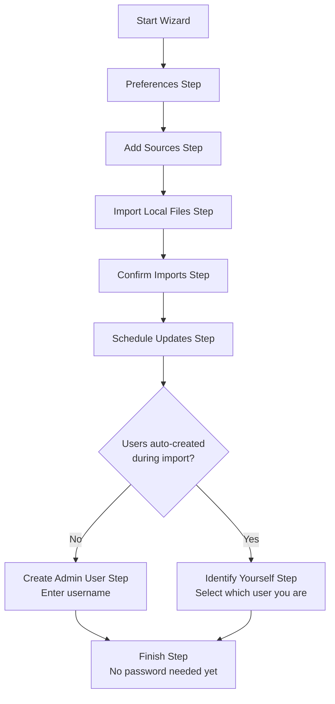
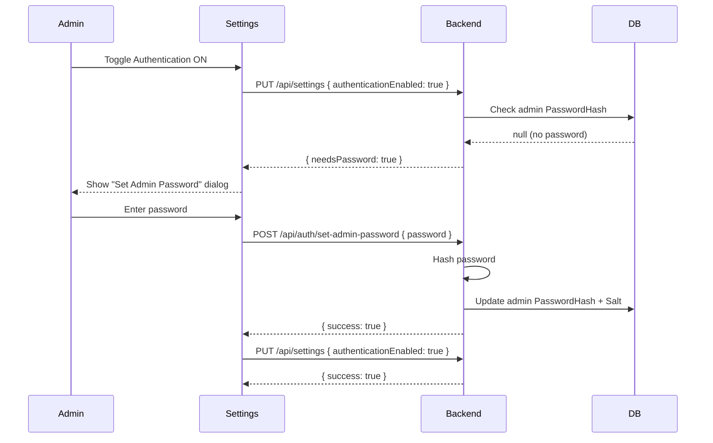
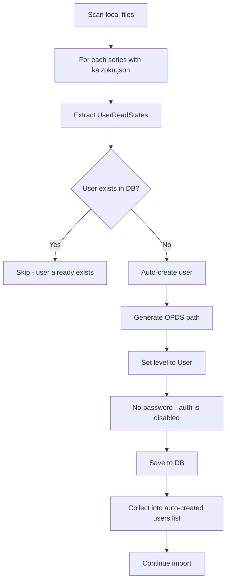
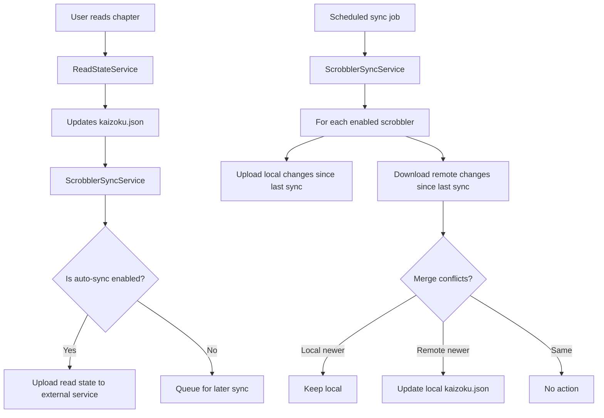
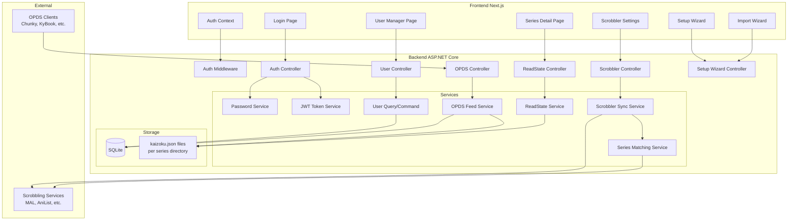
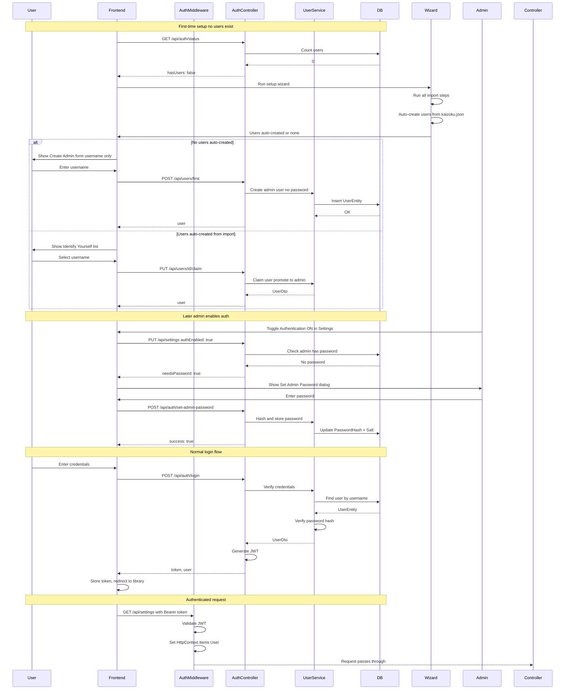
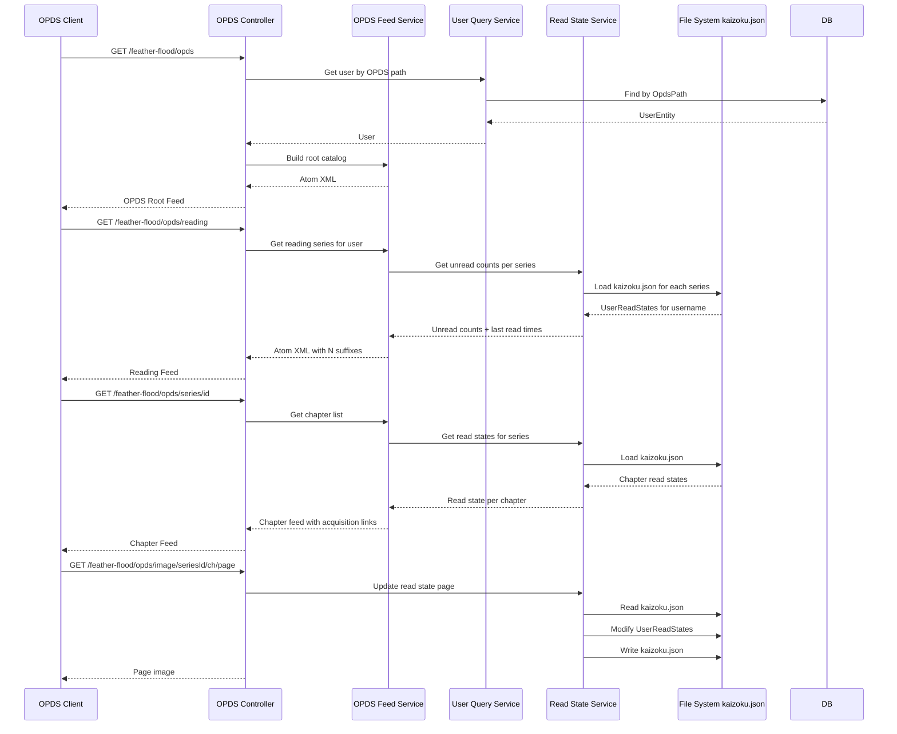
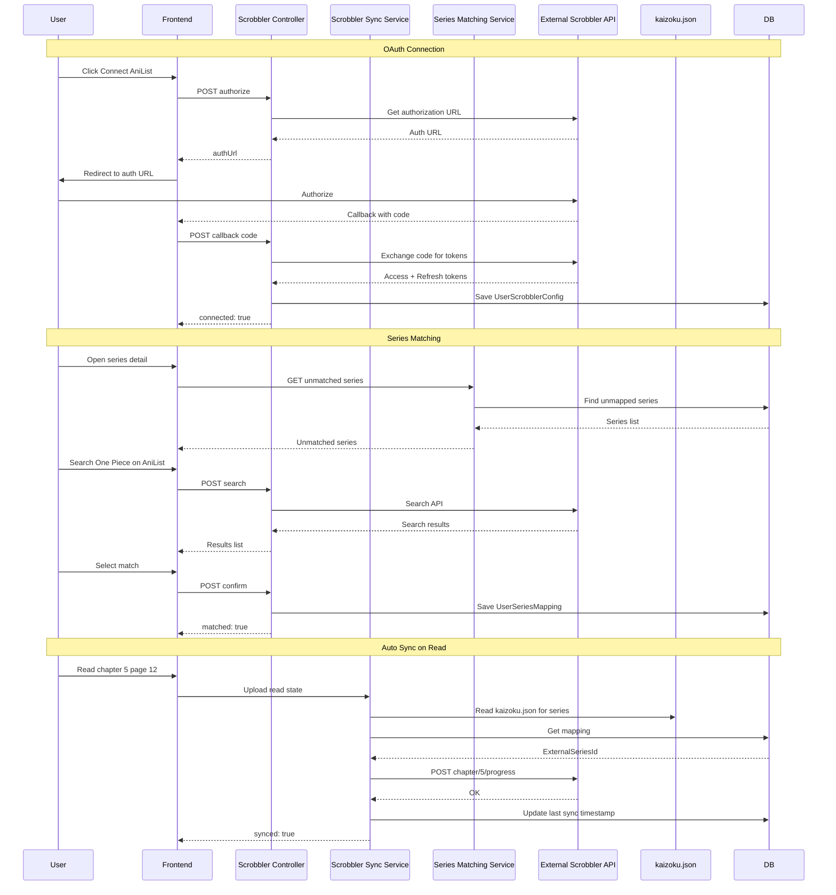
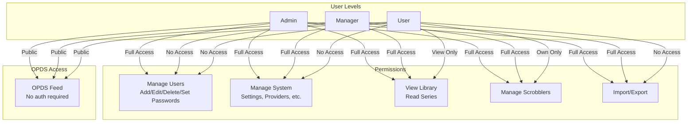
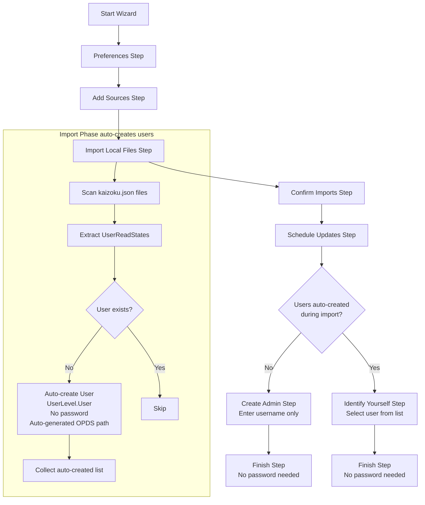

# User Management System - Implementation Plan

## Overview

This plan covers the complete user management system for Kaizoku.NET, including authentication, authorization, OPDS per-user paths, read-state tracking (kaizoku.json only), and third-party scrobbling integration. The system is designed to be modular, with clear separation of concerns across multiple sub-plans.

---

## Table of Contents

1. [Sub-Plan A: Database & Core Entities](#sub-plan-a-database--core-entities)
2. [Sub-Plan B: Authentication & Authorization Middleware](#sub-plan-b-authentication--authorization-middleware)
3. [Sub-Plan C: User Management API & Frontend](#sub-plan-c-user-management-api--frontend)
4. [Sub-Plan D: First-User Setup & Initial Admin Flow](#sub-plan-d-first-user-setup--initial-admin-flow)
5. [Sub-Plan E: OPDS Per-User Paths & Feed](#sub-plan-e-opds-per-user-paths--feed)
6. [Sub-Plan F: Read-State Tracking (kaizoku.json Only)](#sub-plan-f-read-state-tracking-kaizokujson-only)
7. [Sub-Plan G: Import Wizard User Integration](#sub-plan-g-import-wizard-user-integration)
8. [Sub-Plan H: Third-Party Scrobbling / Tracking Integration](#sub-plan-h-third-party-scrobbling--tracking-integration)
9. [Architecture Diagrams](#architecture-diagrams)

---

## Sub-Plan A: Database & Core Entities

### A.1 New Entity: `UserEntity`

**File**: `KaizokuBackend/Models/Database/UserEntity.cs`

```csharp
public class UserEntity
{
    [Key]
    public Guid Id { get; set; }

    [Required]
    public string Username { get; set; } = string.Empty;

    // Avatar image stored as blob - uploaded directly or fetched from Gravatar by the frontend
    public byte[]? AvatarBlob { get; set; }
    public string? AvatarContentType { get; set; } // e.g. "image/png", "image/jpeg"

    // Nullable - users can exist without passwords when auth is disabled
    public string? PasswordHash { get; set; }
    public string? Salt { get; set; }

    // One-time token for password set link (set when admin invites user)
    public string? PasswordSetToken { get; set; }

    [Required]
    public UserLevel Level { get; set; } = UserLevel.User;

    [Required]
    public string OpdsPath { get; set; } = string.Empty; // e.g. "feather-flood"

    public DateTime CreatedAt { get; set; } = DateTime.UtcNow;
    public DateTime? LastLoginAt { get; set; }
    public bool IsActive { get; set; } = true;
}
```

**IMPORTANT: Email is NEVER stored in the database.** Gravatar is a frontend-only feature. The frontend offers two avatar options:
1. **Upload file** - user picks a local image file, it is sent as base64 to the backend
2. **Get from Gravatar** - user enters their email on the frontend. The frontend fetches the Gravatar image (`https://www.gravatar.com/avatar/{md5(email)}?s=128&d=mp`), converts it to base64, and sends it to the backend as an avatar upload. The email is discarded after the fetch.

In both cases, the result is the same: the `AvatarBlob` is stored. The frontend never sends the email to the backend.

**Avatar display (frontend):**
1. If `avatarBase64` is present on `UserDto`: render as ``
2. Else: show a default user silhouette icon (Lucide `User`)

### A.2 New Enum: `UserLevel`

**File**: `KaizokuBackend/Models/Enums/UserLevel.cs`

```csharp
public enum UserLevel
{
    User = 0,
    Manager = 1,
    Admin = 2
}
```

### A.3 No `UserReadStateEntity` - Read state is kaizoku.json only

Read state is NEVER stored in the database. It is stored exclusively in each series directory's `kaizoku.json` file. See [Sub-Plan F](#sub-plan-f-read-state-tracking-kaizokujson-only) for details.

### A.4 New Entity: `UserScrobblerConfigEntity` (for Sub-Plan H)

**File**: `KaizokuBackend/Models/Database/UserScrobblerConfigEntity.cs`

```csharp
public class UserScrobblerConfigEntity
{
    [Key]
    public Guid Id { get; set; }

    [Required]
    public Guid UserId { get; set; }

    [Required]
    public ScrobblerProvider Provider { get; set; }

    public string? AccessToken { get; set; }
    public string? RefreshToken { get; set; }
    public DateTime? TokenExpiresAt { get; set; }

    public bool IsEnabled { get; set; } = true;
    public bool AutoSync { get; set; } = true;

    public DateTime? LastSyncAt { get; set; }
    public DateTime? LastUploadAt { get; set; }
    public DateTime? LastDownloadAt { get; set; }

    [ForeignKey(nameof(UserId))]
    public UserEntity? User { get; set; }
}
```

### A.5 New Entity: `UserSeriesMappingEntity` (for Sub-Plan H)

Stores the mapping between a local series and its ID on the external scrobbling service.

```csharp
public class UserSeriesMappingEntity
{
    [Key]
    public Guid Id { get; set; }

    [Required]
    public Guid UserId { get; set; }

    [Required]
    public Guid SeriesId { get; set; }

    [Required]
    public ScrobblerProvider Provider { get; set; }

    public string ExternalSeriesId { get; set; } = string.Empty;
    public string? ExternalSeriesTitle { get; set; }

    public SeriesMappingStatus MappingStatus { get; set; } = SeriesMappingStatus.Unmatched;

    [ForeignKey(nameof(UserId))]
    public UserEntity? User { get; set; }
}

public enum SeriesMappingStatus
{
    Unmatched = 0,
    AutoMatched = 1,
    UserConfirmed = 2,
    Ignored = 3
}
```

### A.6 New Enum: `ScrobblerProvider`

**File**: `KaizokuBackend/Models/Enums/ScrobblerProvider.cs`

```csharp
public enum ScrobblerProvider
{
    MyAnimeList = 0,
    AniList = 1,
    MangaUpdates = 2,
    ComicVine = 3,
    Kitsu = 4,
    MangaDex = 5
}
```

### A.7 AppDbContext Updates

**File**: `KaizokuBackend/Data/AppDbContext.cs`

Add new DbSets:

```csharp
public DbSet<UserEntity> Users { get; set; }
public DbSet<UserScrobblerConfigEntity> UserScrobblerConfigs { get; set; }
public DbSet<UserSeriesMappingEntity> UserSeriesMappings { get; set; }
```

Add entity configurations in `OnModelCreating`:

- `UserEntity`: Unique index on `Username`, unique index on `OpdsPath`
- `UserScrobblerConfigEntity`: Composite unique index on `(UserId, Provider)`
- `UserSeriesMappingEntity`: Composite unique index on `(UserId, SeriesId, Provider)`

### A.8 Configuration Updates

**File**: `KaizokuBackend/appsettings.json`

Add new configuration flags:

```json
{
  "Authentication": {
    "ResetFirstAdminPassword": false,
    "SessionExpirationHours": 24,
    "RememberMeExpirationDays": 30,
    "JwtSecret": ""
  }
}
```

**Note:** `Authentication.Enabled` is NOT in appsettings.json. It is controlled through app Settings UI and stored in `SettingEntity` table via `EditableSettingsDto.AuthenticationEnabled`. The middleware reads from runtime settings, not appsettings.json.

**JwtSecret auto-generation on first run:**

On first application startup (or if `JwtSecret` is empty), the system:
1. Generates a cryptographically random 256-bit key using `RandomNumberGenerator`
2. Encodes it as a Base64 string
3. Persists it to the appsettings.json (or a separate secrets file)
4. Uses it for all JWT signing operations

This ensures each Kaizoku instance has a unique, unpredictable signing key.

### A.9 EditableSettingsDto Updates

**File**: `KaizokuBackend/Models/Dto/EditableSettingsDto.cs`

Add:

```csharp
[JsonPropertyName("authenticationEnabled")]
public bool AuthenticationEnabled { get; set; } = false;

[JsonPropertyName("externalDomain")]
public string ExternalDomain { get; set; } = string.Empty; // Default resolved at runtime to http://{localIP}:9833
```

---

## Sub-Plan B: Authentication & Authorization Middleware

### B.1 Password Hashing Service

**File**: `KaizokuBackend/Services/Auth/PasswordService.cs`

- Generate a random 128-byte salt using `RandomNumberGenerator`
- Hash password using `Rfc2898DeriveBytes.Pbkdf2` with SHA-256, 600,000 iterations
- Store salt + hash in `UserEntity`
- Provide `VerifyPassword(string password, string hash, string salt)` method
- Provide `HashPassword(string password, out string salt)` method

### B.2 OPDS Path Generator

**File**: `KaizokuBackend/Services/Auth/OpdsPathGenerator.cs`

- Maintain a static list of ~2000 common English words
- Randomly pick two words, join with hyphen (e.g., `feather-flood`)
- Ensure uniqueness against existing `OpdsPath` values in DB
- Retry on collision
- With 2000 words, there are approximately 2000 x 1999 = ~4 million possible combinations, making collisions extremely rare

### B.3 User Invite Token Service

**File**: `KaizokuBackend/Services/Auth/UserInviteService.cs`

- `GeneratePasswordSetToken(UserEntity user)` - Generates a random GUID token, stores it in `UserEntity.PasswordSetToken`, returns the token
- `ConsumePasswordSetToken(Guid userId, string token)` - Validates the token matches, clears it (sets to null), returns true/false. One-time use.
- `GetInviteMessage(UserEntity user, string externalDomain, bool authEnabled)` - Generates the formatted message text

**Generated message formats:**

Without auth (just sharing OPDS path):
```
Hello {username},
Your OPDS path is: {externalDomain}/{opdsPath}
```

With auth (inviting to set password):
```
Hello {username},
Click this link to set your password:
{externalDomain}/auth/set-password?username={username}&token={token}

Your OPDS path is: {externalDomain}/{opdsPath}
```

**Avatar support:** Users can set their avatar in their profile settings by uploading an image file or fetching from Gravatar (frontend-side, email never stored).

The admin copies this text from a textarea in the user management page and shares it with the user out of band (email, chat, etc.).

**Set Password page:**

**File**: `KaizokuFrontend/src/app/auth/set-password/page.tsx` (new)

- Public page (no auth required)
- Reads `username` and `token` from query parameters
- Shows a form with: new password + confirm password
- On submit: `POST /api/auth/set-password` with `{ username, token, password }`
- Backend validates the token, hashes the password, clears the token, generates a JWT
- Backend returns `{ token, user }` - user is automatically logged in
- Frontend stores the token and redirects user to the library (or home page)
- No need for the user to enter credentials again

**Controller endpoint:**

| Endpoint | Method | Description |
|----------|--------|-------------|
| `POST /api/auth/set-password` | Public | Accept `{ username, token, password }`. Validates token, hashes password, clears token, generates JWT, returns `{ token, user }`. The user is automatically logged in without needing to re-enter credentials. Only works when auth is enabled. |

### B.4 JWT Token Service

**File**: `KaizokuBackend/Services/Auth/JwtTokenService.cs`

- Generate JWT access tokens with claims: `sub` (user ID), `username`, `level` (UserLevel as int), `opdsPath`
- Access token expiration configurable via `Authentication:SessionExpirationHours` (default 24h)
- Signing key: the auto-generated `JwtSecret` from configuration
- Provide `ValidateToken` and `GetPrincipalFromToken` methods

**Refresh Token support (Remember Me):**

When the user checks "Remember Me" during login, a refresh token flow is used.

**UserEntity additions:**

```csharp
public string? RefreshTokenHash { get; set; }  // SHA-256 hash of the raw refresh token
public DateTime? RefreshTokenExpiresAt { get; set; }
```

**Refresh token details:**
- Generated as a cryptographically random 256-bit value using `RandomNumberGenerator`
- The raw token is returned to the client as an httpOnly, Secure, SameSite=Strict cookie
- Only the SHA-256 hash is stored in the database
- **Auto-bump on every app access:** Each time the refresh endpoint is called, the `RefreshTokenExpiresAt` is extended by `RememberMeExpirationDays` from the current time. The user stays logged in as long as they access the app within that window. Re-login is only required after `RememberMeExpirationDays` of inactivity.
- Initial expiration and bump: configured via `Authentication:RememberMeExpirationDays` (default 30 days)
- Rotation: each refresh generates a new refresh token and invalidates the old one

**Refresh endpoints:**

| Endpoint | Method | Description |
|----------|--------|-------------|
| `POST /api/auth/refresh` | Public | Reads refresh token from httpOnly cookie. Validates hash against DB. Generates new access + refresh token pair. Returns new access token in response body, sets new refresh token as cookie. |
| `POST /api/auth/logout` | Authenticated | Clears the refresh token hash from DB and clears the httpOnly cookie. |

**Frontend refresh flow:**
1. Access token is stored in memory (not localStorage) for security
2. On 401 response from any API call, the API client automatically calls `/api/auth/refresh`
3. If refresh succeeds, the new access token is used to retry the original request
4. If refresh fails, redirect to login page
5. Without "Remember Me": only access token is issued, no cookie, session ends when token expires

### B.5 Authentication Middleware

**File**: `KaizokuBackend/Services/Auth/AuthMiddleware.cs`

The middleware has two modes based on the `Authentication:Enabled` flag:

**When auth is DISABLED (`Authentication:Enabled = false`):**
- The middleware reads the `X-Kaizoku-User` header from the request
- Looks up the user by username in the database
- Sets `HttpContext.Items["User"]` with the `UserEntity` (or null if user not found)
- No JWT check, no password verification
- If no `X-Kaizoku-User` header: `HttpContext.Items["User"]` is NOT set (guest mode)
- The `RequireUserLevelAttribute` still allows access since auth is disabled
- This header is set by the frontend after the user selects their identity

**When auth is ENABLED (`Authentication:Enabled = true`):**
- Intercept all requests except:
  - `POST /api/auth/login`
  - `POST /api/auth/select-user`
  - `GET /api/auth/status`
  - `POST /api/users/first` (only when no users exist)
  - All `/{opdsPath}/**` endpoints (OPDS is always public - all routes under the user's OPDS path)
- Validate JWT from `Authorization: Bearer <token>` header
- Set `HttpContext.Items["User"]` with the `UserEntity` for downstream use
- Return 401 if token missing/invalid

### B.5 Authorization Attribute

**File**: `KaizokuBackend/Services/Auth/RequireUserLevelAttribute.cs`

```csharp
[AttributeUsage(AttributeTargets.Class | AttributeTargets.Method)]
public class RequireUserLevelAttribute : Attribute, IAuthorizationFilter
{
    private readonly UserLevel _minimumLevel;

    public RequireUserLevelAttribute(UserLevel minimumLevel)
    {
        _minimumLevel = minimumLevel;
    }

    public void OnAuthorization(AuthorizationFilterContext context)
    {
        // Check if auth is enabled; if not, skip
        // Get user from HttpContext.Items
        // Compare user level against _minimumLevel
        // Return 403 if insufficient
    }
}
```

### B.6 Auth Controller

**File**: `KaizokuBackend/Controllers/AuthController.cs`

| Endpoint | Method | Auth | Description |
|----------|--------|------|-------------|
| `POST /api/auth/login` | Public | N/A | Accept `{ username, password }`, return JWT token + user info. Only usable when auth is enabled. |
| `POST /api/auth/select-user` | Public | N/A | Accept `{ username }`. Available when auth is disabled. Returns user info. The frontend stores this username and sends it as `X-Kaizoku-User` header on subsequent requests. |
| `POST /api/auth/change-password` | Authenticated | Yes | Accept `{ currentPassword, newPassword }` |
| `PUT /api/auth/me` | Authenticated | Yes | Update current user profile/avatar. Accepts `{ avatarBase64?, avatarContentType?, removeAvatar? }`. Backend stores blob in DB, returns updated `UserDto` with `avatarBase64`. |
| `GET /api/auth/me` | Authenticated | Yes | Return current user info including `avatarBase64` and `avatarContentType` |
| `GET /api/auth/status` | Public | N/A | Return `{ authenticationEnabled, hasUsers, users }`. When auth is disabled, also returns the list of all users `[{ id, username, avatarBase64, avatarContentType }]` so the frontend can show the user selector with avatars. |

### B.7 Startup.cs Updates

**File**: `KaizokuBackend/Startup.cs`

- Register `PasswordService`, `OpdsPathGenerator`, `JwtTokenService` in DI
- Add `AuthMiddleware` to the pipeline (after CORS, before routing)
- Register `AuthController`

### B.8 ServiceExtensions Updates

**File**: `KaizokuBackend/Services/ServiceExtensions.cs`

Add:

```csharp
public static IServiceCollection AddAuthServices(this IServiceCollection services)
{
    services.TryAddScoped<PasswordService>();
    services.TryAddScoped<OpdsPathGenerator>();
    services.TryAddScoped<JwtTokenService>();
    services.TryAddScoped<UserInviteService>();
    services.TryAddScoped<UserQueryService>();
    services.TryAddScoped<UserCommandService>();
    return services;
}
```

---

## Sub-Plan C: User Management API & Frontend

### C.1 User DTOs

**File**: `KaizokuBackend/Models/Dto/UserDto.cs`

```csharp
public class UserDto
{
    public Guid Id { get; set; }
    public string Username { get; set; } = string.Empty;
    public string? AvatarBase64 { get; set; }      // Base64-encoded avatar image, null if not set
    public string? AvatarContentType { get; set; } // MIME type of the avatar
    public UserLevel Level { get; set; }
    public string OpdsPath { get; set; } = string.Empty;
    public DateTime CreatedAt { get; set; }
    public DateTime? LastLoginAt { get; set; }
    public bool IsActive { get; set; }
    public bool HasPassword { get; set; }
}

public class CreateUserDto
{
    [Required]
    public string Username { get; set; } = string.Empty;
    public UserLevel Level { get; set; } = UserLevel.User;
    // No password field - user must be invited via generate-invite endpoint
}

public class UpdateUserDto
{
    public string? AvatarBase64 { get; set; } // Base64-encoded image data for upload
    public string? AvatarContentType { get; set; } // e.g. "image/png"
    public bool? RemoveAvatar { get; set; } // Set true to delete the avatar
    public UserLevel? Level { get; set; }
    public bool? IsActive { get; set; }
}

public class ChangePasswordDto
{
    [Required]
    public string CurrentPassword { get; set; } = string.Empty;
    [Required]
    public string NewPassword { get; set; } = string.Empty;
}

public class SetPasswordDto
{
    [Required]
    public string Password { get; set; } = string.Empty;
}
```

### C.2 User Controller

**File**: `KaizokuBackend/Controllers/UserController.cs`

| Endpoint | Method | Auth Required | Min Level | Description |
|----------|--------|---------------|-----------|-------------|
| `GET /api/users` | List | Yes | Admin | List all users |
| `GET /api/users/{id}` | Get | Yes | Admin | Get user details |
| `POST /api/users` | Create | Yes | Admin | Create new user. No password field - user must be invited afterward. |
| `PUT /api/users/{id}` | Update | Yes | Admin | Update user avatar, level, active status. Password is NOT managed here - use invite endpoint. |
| `DELETE /api/users/{id}` | Delete | Yes | Admin | Delete user |
| `GET /api/users/me` | Me | Yes | Any | Get current user's own info |
| `PUT /api/users/me/password` | Change own password | Yes | Any | User changes own password |
| `POST /api/users/{id}/generate-invite` | Generate invite | Yes | Admin | Generates `PasswordSetToken`, invalidates old one if exists. Returns formatted invite message with external domain. |

**Password management rules:**
- Admin does NOT set or know user passwords. Instead, the admin generates an invite token.
- For each user, an "Invite" button generates a `PasswordSetToken` and returns a formatted invite message
- For password resets: a "Reset Password" button invalidates the old token and generates a new one
- The admin copies the message and shares it with the user (out of band)
- The user clicks the link and sets their own password
- Users can also change their own password via `PUT /api/users/me/password` after logging in
- When creating a user, no password is set. An invite must be sent afterward.

### C.3 User Query/Command Services

**File**: `KaizokuBackend/Services/Users/UserQueryService.cs`
**File**: `KaizokuBackend/Services/Users/UserCommandService.cs`

- `UserQueryService`: List users, get by ID, get by username, get by OPDS path, check if any users exist, check if any user has a password set
- `UserCommandService`: Create user (generate OPDS path, hash password if provided), update user (set/reset password, change level, toggle active, set/remove avatar blob), delete user, change password
- `AvatarService`: Decodes `AvatarBase64` string to byte array, validates size (max 2MB), stores blob in `UserEntity.AvatarBlob`. Generates `GravatarUrl` from email using MD5 hash.

### C.4 Frontend: User Management Page

**File**: `KaizokuFrontend/src/app/users/page.tsx` (new)
**File**: `KaizokuFrontend/src/app/users/layout.tsx` (new)
**File**: `KaizokuFrontend/src/components/kzk/users/user-manager.tsx` (new)
**File**: `KaizokuFrontend/src/components/kzk/users/user-dialog.tsx` (new)

- Admin-only page accessible from sidebar (only visible to admin users)
- Table listing all users with avatar thumbnail, username, level, OPDS path, active status, last login, has-password indicator
- Create dialog: username, level selector. No password field - user must be invited after creation.
- Edit dialog: **manage avatar**, change level, toggle active. No password field - use "Invite" or "Reset Password" button instead.
  - Avatar management offers two options:
    a) **Upload file**: file input accepting `.png`, `.jpg`, `.gif`, `.webp` up to 2MB with preview
    b) **Get from Gravatar**: user enters email address on frontend. Frontend fetches `https://www.gravatar.com/avatar/{md5(email)}?s=128&d=mp`, converts response to base64. **Email is never sent to the backend.**
  - On save: sends `AvatarBase64` + `AvatarContentType` to backend, backend stores blob in DB
  - "Remove avatar" checkbox to delete the stored blob
- Delete with confirmation
- Inline toggle for active/inactive

**User avatar display priority (everywhere in the UI):**
1. If `avatarBase64` is present on the `UserDto`: render as ``
2. Else: show a default user silhouette icon (Lucide `User`)

#### Invite / Share Feature

For each user in the table, there is an "Invite" button that opens a dialog showing a read-only textarea with the generated invite message.

**The invite dialog reads the `externalDomain` from app settings and calls the backend to generate the message.**

Without auth (auth disabled in settings):
```
Hello {username},
Your OPDS path is: https://kaizoku.example.com/feather-flood
```

With auth (auth enabled in settings):
```
Hello {username},
Click this link to set your password:
https://kaizoku.example.com/auth/set-password?username={username}&token={random-guid}

Your OPDS path is: https://kaizoku.example.com/feather-flood
```

The admin clicks a "Generate Token & Copy" button which:
1. Calls `POST /api/users/{id}/generate-invite` - generates a new `PasswordSetToken` (GUID) on the user, stores it in DB
2. Returns the formatted message with the token embedded in the URL
3. Copies the text to clipboard automatically

The dialog also has a "Regenerate Token" button that invalidates the previous token and creates a new one.

**Backend endpoint:**

| Endpoint | Method | Auth | Min Level | Description |
|----------|--------|------|-----------|-------------|
| `POST /api/users/{id}/generate-invite` | Generate invite | Yes | Admin | Generates `PasswordSetToken`, returns formatted invite message using `ExternalDomain` from settings |

**Frontend invite dialog:**

**File**: `KaizokuFrontend/src/components/kzk/users/user-invite-dialog.tsx` (new)

### C.5 Frontend: Sidebar Updates

**File**: `KaizokuFrontend/src/components/kzk/layout/sidebar.tsx`

Add "Users" navigation item (conditionally visible based on user level).

### C.6 Frontend: API Types & Services

**File**: `KaizokuFrontend/src/lib/api/types.ts`

Add:

```typescript
export interface User {
  id: string;
  username: string;
  level: UserLevel;
  opdsPath: string;
  createdAt: string;
  lastLoginAt?: string;
  isActive: boolean;
  hasPassword: boolean;
}

export enum UserLevel {
  User = 0,
  Manager = 1,
  Admin = 2,
}

export interface CreateUserRequest {
  username: string;
  password?: string;
  level: UserLevel;
}

export interface UpdateUserRequest {
  password?: string;
  level?: UserLevel;
  isActive?: boolean;
}

export interface AuthStatus {
  authenticationEnabled: boolean;
  hasUsers: boolean;
  users?: Array<{ id: string; username: string; avatarBase64?: string; avatarContentType?: string }>;
}

export interface LoginResponse {
  token: string;
  user: User;
}
```

**File**: `KaizokuFrontend/src/lib/api/services/userService.ts` (new)
**File**: `KaizokuFrontend/src/lib/api/hooks/useUsers.ts` (new)
**File**: `KaizokuFrontend/src/lib/api/hooks/useAuth.ts` (new)

### C.7 Frontend: Auth Context & User Selection

**File**: `KaizokuFrontend/src/contexts/auth-context.tsx` (new)
**File**: `KaizokuFrontend/src/app/login/page.tsx` (new)
**File**: `KaizokuFrontend/src/app/user-select/page.tsx` (new)

**AuthContext provides:**
- `user`, `isAuthenticated`, `isLoading`, `login()`, `logout()`, `changePassword()`, `selectUser(username)`
- `isAuthEnabled` - whether the system requires authentication
- `availableUsers` - list of users when auth is disabled

**On app load flow:**
1. Call `GET /api/auth/status`
2. If `authenticationEnabled === true` and no JWT token -> redirect to `/login`
3. If `authenticationEnabled === false` and no user selected -> redirect to `/user-select`

**Login page ( `/login` ):**
- Username + password form
- "Remember Me" checkbox for refresh token
- Only shown when auth is enabled

**User Select page ( `/user-select` ):**
- Shown when auth is disabled
- Displays a list of all users from `GET /api/auth/status.users`
- Each user shown with username and avatar thumbnail
- If `avatarBase64` is present: renders ``
- If no avatar: shows a default user silhouette icon (Lucide `User`)
- User clicks their name to "log in" without a password
- On click: `POST /api/auth/select-user { username }` -> backend returns `{ user }`
- Frontend stores the selected username in localStorage
- Frontend sends `X-Kaizoku-User: {username}` header on all subsequent requests
- The selected username persists in localStorage until logout
- On logout: clear stored username, redirect to `/user-select`

**API Client update:**
- When auth is disabled: reads selected username from localStorage and adds `X-Kaizoku-User` header
- When auth is enabled: reads JWT token and adds `Authorization: Bearer` header
- On 401 (auth enabled): redirect to login
- On 404 user not found (auth disabled): redirect to user-select page

### C.8 Frontend: API Client Updates

**File**: `KaizokuFrontend/src/lib/api/client.ts`

- Add `Authorization: Bearer <token>` header to all requests when token exists
- Handle 401 responses by clearing token and redirecting to login
- Handle 403 responses by showing "access denied" toast

---

## Sub-Plan D: First-User Setup & Initial Admin Flow

### D.1 First-User Detection

- On app startup, check if any users exist in the database
- If no users exist, the system is in "setup mode"
- `GET /api/auth/status` returns `{ authenticationEnabled: false, hasUsers: false }`

### D.2 Admin Creation at the END of the Wizard

The admin user creation happens at the **end** of the setup wizard, not at the beginning. This is because the import process may auto-create users (see Sub-Plan G), which changes the flow.

**Wizard Flow:**



**Default behavior:** If users were auto-created during import, the wizard defaults to "Identify Yourself" mode. The "Create Admin" option is presented only when no users exist at all. The admin selects their username from the existing users list rather than creating a new one.

**Key point:** No password is set during the wizard. Authentication is disabled by default. Passwords are only needed when the admin later enables authentication in settings.

### D.3 Wizard Step: Create Admin User

**File**: `KaizokuFrontend/src/components/kzk/setup-wizard/steps/create-admin-step.tsx` (new)

- Shown when no users exist after import completes
- Form fields: Username (required), Email (optional - for Gravatar)
- Validation: username cannot be "admin" or similar reserved names
- On submit: `POST /api/users/first` (special endpoint that only works when no users exist)
- The system auto-generates the OPDS path for this user
- User level is forced to `Admin`
- **No password is set** - authentication is disabled by default
- **Email is stored** and used for Gravatar avatar generation

### D.4 Wizard Step: Identify Yourself

**File**: `KaizokuFrontend/src/components/kzk/setup-wizard/steps/identify-user-step.tsx` (new)

- Shown when users were auto-created during import (from kaizoku.json read states)
- Displays a list of existing users (those auto-created from import)
- User selects which one they are
- On submit: `PUT /api/users/{id}/claim` - marks the user as claimed and promotes to admin
- **No password is set** - authentication is disabled by default

### D.5 First-User API Endpoints

**File**: `KaizokuBackend/Controllers/UserController.cs`

| Endpoint | Method | Description |
|----------|--------|-------------|
| `POST /api/users/first` | Public (no auth) | Create first admin user. Only works when `_db.Users.Count() == 0`. No password required. |
| `PUT /api/users/{id}/claim` | Public (no auth) | Claim an auto-created user. Only works when no admin exists yet. Promotes user to admin. |

### D.6 Enabling Authentication - Password Prompt

When the admin toggles `AuthenticationEnabled` from `false` to `true` in settings:

1. The system checks if the current admin user has a password set (`PasswordHash != null`)
2. If the admin has no password, the system generates a `PasswordSetToken` for the admin
3. A dialog shows the invite message pre-formatted with the admin's username and token
4. The message is automatically copied to the clipboard
5. The admin can paste it into a chat/email to themselves (or a browser tab), click the link, and set their password
6. Once the password is set, the admin toggles authentication ON again (or the system auto-detects the password was set)
7. All other users without passwords will not be able to log in until the admin sends them invites

**Frontend flow:**



### D.7 Admin Password Reset (for other users)

When an admin wants to reset a password for another user:

1. Admin goes to User Management page
2. Finds the target user in the table
3. Clicks the "Reset Password" button for that user
4. Backend generates a new `PasswordSetToken` (invalidating any previous one) via `POST /api/users/{id}/generate-invite`
5. A formatted invite message is returned and auto-copied to clipboard:
```
Hello {username},
Click this link to set your password:
{externalDomain}/auth/set-password?username={username}&token={new-token}

Your OPDS path is: {externalDomain}/{opdsPath}
```
6. Admin shares this message with the user (out of band - chat, email, etc.)
7. The user clicks the link and sets their own password

### D.8 Password Reset Flag

- When `Authentication:ResetFirstAdminPassword` is `true` in config, on next startup:
  - Find the first admin user
  - Clear the password (set `PasswordHash = null`, `Salt = null`)
  - Log a message: "Admin password has been reset. Please set a new password via settings."
  - Set the flag back to `false` after reset
- This is handled in `StartupHostedService` or a new `AuthStartupService`

### D.9 Authentication Toggle Behavior

- When `AuthenticationEnabled` is toggled from `false` to `true`:
  - Prompt admin to set their password if not already set
  - All users without passwords will be unable to log in
  - Admin should set passwords for other users before or after enabling

- When `AuthenticationEnabled` is toggled from `true` to `false`:
  - All users can access the app without login
  - OPDS paths still work for read-state tracking
  - Passwords remain stored in DB (just not required)

---

## Sub-Plan E: OPDS Per-User Paths & Feed

### E.1 OPDS Path Generation

- On user creation, `OpdsPathGenerator` generates a unique two-word hyphenated path
- Example: `feather-flood`, `autumn-breeze`, `silver-mountain`
- The path is stored in `UserEntity.OpdsPath`
- The path is unique across all users (DB unique index)

### E.2 OPDS Controller

**File**: `KaizokuBackend/Controllers/OpdsController.cs` (new)

| Endpoint | Method | Description |
|----------|--------|-------------|
| `GET /{opdsPath}` | Public | Root OPDS catalog (no auth required). Acts as the OPDS root feed. |
| `GET /{opdsPath}/reading` | Public | "Reading" folder - series with unread chapters (ordered by newest unread first, then last-read time) |
| `GET /{opdsPath}/reading/{seriesId}` | Public | Series detail in Reading context - chapters for a series being actively read |
| `GET /{opdsPath}/last-changed` | Public | "Last Changed" folder - recently updated series |
| `GET /{opdsPath}/all-series` | Public | "All Series" folder - all series |
| `GET /{opdsPath}/categories` | Public | "Categories" folder - series grouped by category |
| `GET /{opdsPath}/categories/{category}` | Public | Series in a specific category |
| `GET /{opdsPath}/series/{seriesId}` | Public | Series detail - shows language selection or chapter list depending on provider languages |
| `GET /{opdsPath}/series/{seriesId}/language/{language}` | Public | Chapter list for a series filtered by language |
| `GET /{opdsPath}/series/{seriesId}/language/{language}/chapter/{base64Filename}` | Public | Page list / reader for a chapter. Uses base64-encoded filename as unique identifier. |

**Series and chapter thumbnails** in all OPDS feeds use the **default image set by the user** in their settings (cover image preference). If no custom default is set, the system uses the first available cover from the series providers.

### E.3a Chapter Listing Logic

Multiple providers may serve the same series in different languages, resulting in multiple `SeriesProviderEntity` records per series. Chapters are identified by their **number** (decimal), not by a unique index, because several providers may offer the same chapter number.

**Language selection page:**

When the series has providers in more than one language, `GET /{opdsPath}/series/{seriesId}` returns a language selection page instead of a chapter list:

```xml
<feed xmlns="http://www.w3.org/2005/Atom">
  <id>kaizoku:series:{seriesId}:languages</id>
  <title>Select Language - {seriesTitle}</title>
  <entry>
    <title>en</title>
    <link rel="subsection" href="/{opdsPath}/series/{seriesId}/language/en"/>
  </entry>
  <entry>
    <title>ja</title>
    <link rel="subsection" href="/{opdsPath}/series/{seriesId}/language/ja"/>
  </entry>
</feed>
```

If the series has providers in only ONE language, the language selection is skipped and the chapter list is returned directly at `GET /{opdsPath}/series/{seriesId}`.

**Duplicate chapter deduplication:**

Within a single language, multiple providers may have the same chapter number. The system deduplicates as follows:

1. Group chapters by their `ChapterNumber` across all providers of that language
2. For each chapter number group:
   - If only one chapter exists: use it
   - If multiple chapters exist with the same number: pick the chapter from the **preferred provider** (`ProviderSeriesOption.Preferred == true`, set during import based on chapter completeness and language match)
   - If no provider is marked as preferred, pick the chapter from a **non-temporary** provider first
   - If only temporary providers exist, use the first available chapter
3. Ordered by chapter number ascending

**Chapter acquisition links use chapter number as identifier:**

**Chapter identification:** Each chapter has a unique `Filename` (the stored archive filename, e.g. `ch_005.cbz`). This filename is unique per provider+language combination and serves as the true chapter identifier. For OPDS URLs, the filename is base64-encoded to make it URL-safe.

```
GET /{opdsPath}/series/{seriesId}/language/{language}/chapter/{base64(chapterFilename)}
```

This produces a URL like:
```
GET /{opdsPath}/series/{seriesId}/language/en/chapter/Y2hfMDA1LmNieg
```

The base64 encoding:
- Encodes the raw filename bytes to base64 (standard, not URL-safe variant - the backend handles URL decoding)
- Removes trailing `=` padding characters for cleanliness
- Example: `ch_005.cbz` -> `Y2hfMDA1LmNieg`

This returns the page list for the deduplicated chapter, including acquisition links to individual page images via:

```
GET /{opdsPath}/image/{seriesId}/{language}/{base64(chapterFilename)}/{pageIndex}
```

Read-state tracking uses the combination of series ID + language + filename as the unique key.

### E.3 OPDS Feed Structure

The root catalog returns:

```xml
<feed xmlns="http://www.w3.org/2005/Atom"
      xmlns:opds="http://opds-spec.org/2010/catalog">
  <id>kaizoku:{opdsPath}</id>
  <title>Kaizoku - {username}'s Library</title>
  <entry>
    <title>Reading</title>
    <link rel="subsection" href="/{opdsPath}/reading"/>
  </entry>
  <entry>
    <title>Last Changed</title>
    <link rel="subsection" href="/{opdsPath}/last-changed"/>
  </entry>
  <entry>
    <title>All Series</title>
    <link rel="subsection" href="/{opdsPath}/all-series"/>
  </entry>
  <entry>
    <title>Categories</title>
    <link rel="subsection" href="/{opdsPath}/categories"/>
  </entry>
</feed>
```

### E.5 Reading Folder Logic

The "Reading" folder shows two groups of series:

1. **Reading** - Series where the user has started reading (has at least one read state entry), with `[#number]` suffix showing unread chapters. Ordered by last-read time (most recent first).
2. **Unread** - Series with new chapters but no read state yet, with `[#number]` suffix showing all new chapters. Ordered by newest chapter date (most recent first).

**Caching:** Kaizoku maintains an in-memory read-state cache to avoid reading kaizoku.json from disk on every OPDS request.

**File**: `KaizokuBackend/Services/ReadState/ReadStateCacheService.cs` (new)

```csharp
public class ReadStateCacheService
{
    private readonly MemoryCache _cache;
    private readonly TimeSpan _cacheDuration = TimeSpan.FromMinutes(5);

    // Key: $"readstate:{username}:{seriesStoragePath}", Value: List<ChapterReadState>
    public List<ChapterReadState>? GetCachedReadStates(string username, string seriesStoragePath);
    public void SetCachedReadStates(string username, string seriesStoragePath, List<ChapterReadState> states);
    public void Invalidate(string username, string seriesStoragePath);
    public void InvalidateAll();
}
```

- Cache is populated on first read of a kaizoku.json file
- Invalidated when the user reads a page (write-through invalidation)
- TTL of 5 minutes to prevent stale data in long OPDS sessions
- On cache miss: load from kaizoku.json, populate cache

For each series in the library, the OPDS service:

1. Checks the in-memory cache for the user's read states
2. On cache miss, loads the series' `kaizoku.json`
3. Extracts the `UserReadStates` for the current user (matched by username)
4. Caches the result
5. Compares the chapters in the series provider against the read states
6. Computes unread count and last-read timestamp
7. Sorts accordingly

### E.6 OPDS Service

**File**: `KaizokuBackend/Services/Opds/OpdsFeedService.cs` (new)

- Build Atom XML feeds for OPDS
- Resolve user from OPDS path
- Query series with read-state information from kaizoku.json files
- Generate proper OPDS navigation and acquisition links
- Support page-level reading via OPDS acquisition links pointing to individual pages

### E.7 Page-Level Reading Support

- Each chapter in OPDS returns an acquisition feed with individual page entries
- Page entries include `rel="http://opds-spec.org/acquisition/open-access"` links
- When a page is served via the image proxy, the read state is updated in kaizoku.json for the user
- The reader (e.g., Chunky, KyBook, etc.) requests pages sequentially, allowing per-page read-state tracking

### E.8 OPDS Image Proxy with Archive Extraction & Caching

**File**: `KaizokuBackend/Controllers/OpdsImageController.cs` (new)

**File**: `KaizokuBackend/Services/Opds/OpdsImageService.cs` (new)

**URL format:** `GET /{opdsPath}/image/{seriesId}/{language}/{base64(chapterFilename)}/{pageIndex}`

**Supported archive formats:** `.zip`, `.rar`, `.7zip`

**Extraction flow:**

1. Request arrives for a specific series, chapter, and page
2. The service locates the archive file on disk (from the series storage path)
3. A temp extraction directory is created at: `{tempFolder}/opds-cache/{seriesId}/{language}/{base64Filename}/`
4. The archive is extracted to this temp directory (if not already extracted)
5. The requested page image is served from the temp directory
6. The read state is updated in kaizoku.json and the in-memory cache is invalidated

**ETag / Conditional Requests:**

- Every image response includes an `ETag` header
- ETag is calculated as the SHA-256 hash of the image file content
- ETags are stored in kaizoku.json (see F.2 schema update below)
- `GET` requests with `If-None-Match` header return `304 Not Modified` if the image hash matches
- Browsers and OPDS clients cache images aggressively, reducing repeat requests

**Temp cache management:**

```
temp/
  opds-cache/
    {seriesId}/
      {language}/
        {base64Filename}/
        page_001.jpg
        page_002.jpg
        ...
```

- Maximum cache size: configured by setting `OpdsTempCacheMaxChapters` (default: 50 chapters)
- When the limit is reached, the **oldest accessed** chapter cache is deleted
- Access time is tracked by touching a `.last-access` file in each chapter cache directory
- The cache is scoped to the temp folder, so it is cleaned on application restart

**Concurrency / Wait mechanism:**

- If an archive is in the process of being decompressed, subsequent requests for pages in the same chapter **wait** (using `AsyncLock` / `SemaphoreSlim` keyed by `{seriesId}:{language}:{base64Filename}`)
- The first request triggers extraction, others wait and then read from the extracted cache
- A timeout of 30 seconds is applied to prevent infinite waits on corrupted archives

**When archives are replaced/altered:**

No filesystem watcher or background monitor is used. Detection happens on-demand when a user reads a chapter:

1. A request arrives for a page in a chapter
2. The system compares the archive's current `LastWriteTimeUtc` against the stored value in `ChapterImageHashCache.ArchiveLastModifiedUtc`
3. If they differ: the archive was replaced
4. The temp cache directory for that chapter is deleted
5. The `ImageHashCache` entry for that chapter is cleared from kaizoku.json
6. Decompression, ETag calculation, and kaizoku.json update re-trigger automatically from the standard extraction flow
7. The user gets the new images seamlessly on their first read attempt

---

## Sub-Plan F: Read-State Tracking (kaizoku.json Only)

### F.1 Core Principle

Read state is **never stored in the database**. It is stored exclusively in each series directory's `kaizoku.json` file. This ensures:

- Read state is portable across instances
- Read state survives database resets
- Read state is tied to the series data, not the database
- No migration needed when moving storage

### F.2 kaizoku.json Schema Update

**File**: `KaizokuBackend/Models/ImportSeriesSnapshot.cs`

Bump `KaizokuVersion` to 3 to represent the full schema including read states and image hash cache.

**Additions to `ImportSeriesSnapshot`:**

```csharp
// Per-user read states
public List<UserReadStateSnapshot> UserReadStates { get; set; } = [];

// Per-chapter image ETag hashes for OPDS caching
public List<ChapterImageHashCache> ImageHashCache { get; set; } = [];
```

**New model classes:**

```csharp
public class UserReadStateSnapshot
{
    public string Username { get; set; } = string.Empty;
    public List<ChapterReadState> Chapters { get; set; } = [];
}

public class ChapterReadState
{
    public decimal ChapterNumber { get; set; }
    public int LastReadPage { get; set; }
    public int TotalPages { get; set; }
    public bool IsCompleted { get; set; }
    public DateTime LastReadAt { get; set; }
}

public class ChapterImageHashCache
{
    public decimal ChapterNumber { get; set; }
    public DateTime ArchiveLastModifiedUtc { get; set; } // To detect archive replacement
    public Dictionary<int, string> PageHashes { get; set; } = []; // pageIndex -> SHA-256 hex hash
}
```

**`ImageHashCache` behavior:**
- On first extraction of a chapter, each page image's SHA-256 hash is computed
- Hashes are stored in `ImageHashCache` with the chapter number and `ArchiveLastModifiedUtc`
- On subsequent requests for the same chapter+page, if the `ArchiveLastModifiedUtc` matches the current file's `LastWriteTimeUtc`, the cached hash is used for the ETag header
- When the archive is replaced or altered (`LastWriteTimeUtc` changed), the cache entry for that chapter is cleared and re-computed
- The `ImageHashCache` persists in kaizoku.json, so ETags survive application restarts
- Image hash cache entries are cleared when the chapter is replaced/altered, not on every read

### F.3 Read-State Service

**File**: `KaizokuBackend/Services/ReadState/ReadStateService.cs` (new)

This service reads/writes read state directly to kaizoku.json files. It does NOT use the database.

```csharp
public class ReadStateService
{
    // Read
    public ChapterReadState? GetReadState(string username, string seriesStoragePath, decimal chapterNumber)
    public List<ChapterReadState> GetSeriesReadStates(string username, string seriesStoragePath)
    public int GetUnreadChaptersCount(string username, string seriesStoragePath, int totalChapters)

    // Write
    public void SetReadState(string username, string seriesStoragePath, decimal chapterNumber, int lastReadPage, int totalPages)
    public void MarkChapterCompleted(string username, string seriesStoragePath, decimal chapterNumber)

    // Bulk
    public List<UserReadStateSnapshot> GetAllUserReadStates(string seriesStoragePath)
    public void ImportUserReadStates(string seriesStoragePath, List<UserReadStateSnapshot> readStates)
}
```

**Key implementation detail**: The service loads the full `ImportSeriesSnapshot` from kaizoku.json, modifies the `UserReadStates` list, and saves it back. This is a read-modify-write pattern with file locking to prevent concurrent access issues.

### F.4 Read-State Controller

**File**: `KaizokuBackend/Controllers/ReadStateController.cs` (new)

| Endpoint | Method | Auth | Description |
|----------|--------|------|-------------|
| `GET /api/read-state/series/{seriesId}` | Get series read state | Yes | All chapter read states for a series for current user |
| `PUT /api/read-state/series/{seriesId}/chapter/{chapterNumber}` | Update | Yes | Update read state for a chapter |
| `POST /api/read-state/series/{seriesId}/chapter/{chapterNumber}/complete` | Complete | Yes | Mark chapter as completed |

All endpoints resolve the current user from the JWT, then read/write to the series' kaizoku.json.

### F.5 Frontend: Read-State Display

Read-state is shown at the **series level** in the library grid/cards. No per-chapter UI is shown in the frontend.

**Visual indicators on each series card:**

- **Unread count badge** - Shows the number of unread chapters for the current user
  - Yellow/amber badge: series has unread chapters (some read, some not)
  - Green badge: series is fully read (all chapters completed)
  - No badge: series has no read state (all chapters unread)
- **Progress bar** - A thin horizontal bar at the bottom of the series card showing the ratio of completed chapters to total chapters. This gives a quick visual of reading progress without needing to enter the series detail.

**Data source:** The read-state is derived from the current user's kaizoku.json data, loaded via the ReadStateController. The series list endpoint is augmented to include read-state summary (unread count, completion percentage) per user. When auth is disabled, read-state defaults to the first user or no read-state display.

---

## Sub-Plan G: Import Wizard User Integration

### G.1 Auto-Create Users During Import

When the import wizard scans series directories and finds kaizoku.json files with `UserReadStates`, the system **automatically creates** any users that don't already exist in the database.

**Flow:**



**Key behaviors:**

- Auto-created users get `UserLevel.User` (not admin)
- Auto-created users get **no password** (authentication is disabled by default)
- Auto-created users get an auto-generated OPDS path
- The list of auto-created usernames is tracked for the wizard's "Identify Yourself" step

### G.2 Backend: Import User Read States

**File**: `KaizokuBackend/Services/Import/ImportCommandService.cs`

During the import process, after series are imported:

1. Scan each series directory for kaizoku.json
2. Extract `UserReadStates` from the snapshot
3. For each username in the read states:
   - If user exists in DB: read states are already in kaizoku.json, no action needed
   - If user doesn't exist: auto-create the user (see G.1) - **no password, no temp password**
4. Return a list of auto-created usernames to the wizard

### G.3 Import Wizard Updates

**File**: `KaizokuFrontend/src/components/kzk/import-wizard/index.tsx`

- No new step needed for user import (it's automatic)
- The wizard tracks whether users were auto-created
- This information is passed to the setup wizard's final step

### G.4 Setup Wizard Integration

The setup wizard's final step (after import) checks:

1. Were any users auto-created during import?
   - Yes: Show "Identify Yourself" step - user picks their username from the list
   - No: Show "Create Admin" step - user enters a new admin username
2. After identification/creation, the wizard completes
3. **No password is set during the wizard** - authentication is disabled by default

---

## Sub-Plan H: Third-Party Scrobbling / Tracking Integration

### H.1 Scrobbler Service Architecture



### H.2 Scrobbler Provider Implementations

**File**: `KaizokuBackend/Services/Scrobbling/IScrobblerProvider.cs` (new)

```csharp
public interface IScrobblerProvider
{
    ScrobblerProvider ProviderType { get; }
    string Name { get; }

    // OAuth flow
    Task<string> GetAuthorizationUrlAsync(string redirectUri);
    Task<TokenResult> ExchangeCodeAsync(string code, string redirectUri);
    Task<TokenResult> RefreshTokenAsync(string refreshToken);

    // Series matching
    Task<List<ScrobblerSeriesMatch>> SearchSeriesAsync(string query, string? type = null);

    // Read state
    Task<bool> UploadChapterReadAsync(string externalSeriesId, decimal chapterNumber, int page);
    Task<Dictionary<decimal, int>> GetReadChaptersAsync(string externalSeriesId);

    // Health check
    Task<bool> ValidateTokenAsync();
}
```

**Implementations** (one per supported service):
- `MyAnimeListScrobblerProvider`
- `AniListScrobblerProvider`
- `MangaUpdatesScrobblerProvider`
- `ComicVineScrobblerProvider`

### H.3 Scrobbler Sync Service

**File**: `KaizokuBackend/Services/Scrobbling/ScrobblerSyncService.cs` (new)

- `SyncForUserAsync(userId)` - Sync all enabled scrobblers for a user
- `SyncForUserAndSeriesAsync(userId, seriesId)` - Sync a specific series
- `UploadReadStateAsync(userId, seriesId, chapterNumber, page)` - Upload on read
- `DownloadReadStateAsync(userId, scrobblerProvider)` - Download remote state
- Conflict resolution: last-write-wins with timestamp comparison
- Read state is read from/written to kaizoku.json (not DB)

### H.4 Series Matching System

**File**: `KaizokuBackend/Services/Scrobbling/SeriesMatchingService.cs` (new)

- `AutoMatchSeries(userId, seriesId)` - Try to auto-match a series by title
- `SearchExternalSeries(userId, scrobblerProvider, query)` - Search external service
- `ConfirmMatch(userId, seriesId, scrobblerProvider, externalSeriesId)` - User confirms a match
- `GetUnmatchedSeries(userId)` - Get all series that need manual matching

### H.5 Scrobbler Controller

**File**: `KaizokuBackend/Controllers/ScrobblerController.cs` (new)

| Endpoint | Method | Auth | Min Level | Description |
|----------|--------|------|-----------|-------------|
| `GET /api/scrobbler/providers` | List providers | Yes | Any | List available scrobbler providers |
| `GET /api/scrobbler/config` | Get configs | Yes | Any | Get user's scrobbler configs |
| `PUT /api/scrobbler/config/{provider}` | Update config | Yes | Any | Enable/disable, set tokens |
| `POST /api/scrobbler/config/{provider}/authorize` | Start OAuth | Yes | Any | Get authorization URL |
| `POST /api/scrobbler/config/{provider}/callback` | OAuth callback | Yes | Any | Exchange code for tokens |
| `GET /api/scrobbler/matches` | List matches | Yes | Any | Get series mapping status |
| `POST /api/scrobbler/matches/search` | Search external | Yes | Any | Search external service for series |
| `POST /api/scrobbler/matches/confirm` | Confirm match | Yes | Any | User confirms a series match |
| `POST /api/scrobbler/sync` | Trigger sync | Yes | Any | Trigger manual sync |
| `GET /api/scrobbler/sync/status` | Sync status | Yes | Any | Get last sync timestamps |

### H.6 Frontend: Scrobbler Settings

**File**: `KaizokuFrontend/src/components/kzk/scrobbler/scrobbler-settings.tsx` (new)
**File**: `KaizokuFrontend/src/components/kzk/scrobbler/series-match-dialog.tsx` (new)

- Settings page section for scrobbler configuration
- Per-provider enable/disable toggle
- OAuth authorization flow (opens external URL, callback handled)
- Series matching dialog accessible from series detail page
- Shows match status per series per provider
- Manual search and confirm UI

### H.7 Scheduled Sync Job

**File**: `KaizokuBackend/Services/Jobs/Commands/ScrobblerSync.cs` (new)

- New `JobType.ScrobblerSync`
- Runs periodically (configurable, default every 6 hours)
- For each user with enabled scrobblers:
  - Upload local changes since last upload
  - Download remote changes since last download
  - Merge and update local kaizoku.json read states

### H.8 Scrobbler DTOs

**File**: `KaizokuBackend/Models/Dto/ScrobblerDto.cs` (new)

```csharp
public class ScrobblerConfigDto
{
    public ScrobblerProvider Provider { get; set; }
    public string Name { get; set; } = string.Empty;
    public bool IsEnabled { get; set; }
    public bool IsConnected { get; set; }
    public bool AutoSync { get; set; }
    public DateTime? LastSyncAt { get; set; }
}

public class ScrobblerSeriesMatchDto
{
    public Guid SeriesId { get; set; }
    public string SeriesTitle { get; set; } = string.Empty;
    public ScrobblerProvider Provider { get; set; }
    public SeriesMappingStatus MappingStatus { get; set; }
    public string? ExternalSeriesId { get; set; }
    public string? ExternalSeriesTitle { get; set; }
}

public class ScrobblerSearchResultDto
{
    public string ExternalId { get; set; } = string.Empty;
    public string Title { get; set; } = string.Empty;
    public string? CoverUrl { get; set; }
    public string? Type { get; set; }
    public int? ChapterCount { get; set; }
    public string? Status { get; set; }
}
```

---

## Architecture Diagrams

### Overall System Architecture



### Authentication Flow



### OPDS Flow with kaizoku.json Read State



### Scrobbler Sync Flow



### User Level Authorization Matrix



### Setup Wizard Flow with User Creation



---

## Implementation Order

The sub-plans should be implemented in this order:

1. **Sub-Plan A** (Database & Core Entities) - Foundation for everything
2. **Sub-Plan B** (Authentication & Authorization Middleware) - Security infrastructure
3. **Sub-Plan D** (First-User Setup) - Must exist before user management
4. **Sub-Plan C** (User Management API & Frontend) - CRUD operations
5. **Sub-Plan F** (Read-State Tracking - kaizoku.json only) - Core feature
6. **Sub-Plan E** (OPDS Per-User Paths) - Depends on read states
7. **Sub-Plan G** (Import Wizard User Integration) - Depends on read states
8. **Sub-Plan H** (Third-Party Scrobbling) - Independent but complex, can be done last

---

## Feedback & Considerations

1. **Password Reset Flag**: The `ResetFirstAdminPassword` config flag clears the admin password (sets to null), allowing the admin to set a new one via settings. Consider also adding a CLI command for this in the future.

2. **OPDS Security**: OPDS endpoints are intentionally public (no auth) as specified. The OPDS path acts as a secret URL - it is effectively a security-by-obscurity mechanism. Users should be warned to keep their OPDS path private.

3. **kaizoku.json Versioning**: Bump the `KaizokuVersion` field to 2 when adding user read states. This allows backward compatibility when reading older kaizoku.json files.

4. **kaizoku.json Concurrency**: Since read state is file-based, concurrent writes to the same kaizoku.json could cause data loss. Use a file lock mechanism (e.g., `AsyncLock` or `SemaphoreSlim` keyed by file path) to serialize writes.

5. **Password Sharing**: The only way for users to get their password is from the admin in plain text. The admin sets/resets passwords via the User Management page. Users should change their password after first login. This is a deliberate design choice - there is no "forgot password" or email reset flow.

6. **Scrobbler Rate Limiting**: External APIs have rate limits. The sync service should implement exponential backoff and respect rate limit headers.

7. **Scrobbler Matching UX**: The matching UI should support fuzzy search and show series details (cover, description) to help users identify the correct match. Consider adding a batch match mode for power users.

8. **Performance**: For large libraries, the OPDS Reading folder query could be expensive since it reads kaizoku.json for every series. Consider caching parsed read states in memory with a short TTL.

9. **Session Management**: JWT tokens are stateless. For logout, maintain a token blacklist or use short-lived tokens with refresh tokens.

10. **Migration**: Existing users upgrading from a previous version will have no users in the database. The system should handle this gracefully by entering setup mode on first run after upgrade.
